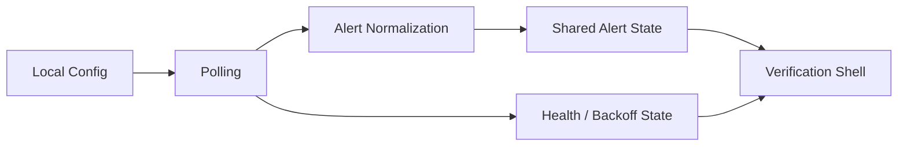

# Watch Tower v0.1 基座版需求

## Problem Frame

当前 `watch-tower` 仓库还只有一个 Rust 占位程序，离可验证的桌面产品链路还差一个完整的“基础闭环”。  
对 `v0.1` 来说，最重要的不是把 Pencil 里的正式主控台、边缘 widget、弹窗提醒一次做完，而是先确认三件事：

1. 桌面宿主能稳定启动并承接后续多窗口形态。
2. 真实 API 数据能被拉取、归一化，并被同一份共享模型消费。
3. 团队能在一个可见的验证界面里快速判断轮询、周期排序、UTC+0 对齐、60-bar 位置计算是否正确。

如果这一层不先做稳，后续 `v0.2+` 的主控台、widget、popup 都会在错误的数据语义和宿主边界上叠复杂度。

## Requirements

**Desktop foundation**
- R1. `v0.1` 必须交付一个可运行的桌面应用壳，而不是仅有命令行或纯库层验证。
- R2. 应用必须支持最小可用配置的本地保存与再次加载，至少覆盖 `API Key`、轮询频率，以及一组监控目标；该组以“单个 `symbol` + 一个或多个 `signalType`”为基本单位。
- R3. `v0.1` 的可见界面以“验证壳”为定位，用于展示和校验数据链路，不承担正式主控台的完整交互职责。

**Signal data pipeline**
- R4. 应用必须能使用 `x-api-key` 调用信号接口，并按配置拉取真实信号数据。
- R5. 应用必须把接口结果归一化为统一的共享告警模型，至少保留 `symbol`、`period`、`signalType`、`side`、`read`、信号时间等核心语义。
- R6. 应用必须对 25 个周期使用固定排序，并在日线、周线场景下按 `UTC+0` 规则计算最近 60 根 K 线中的位置。
- R7. 轮询频率必须具备最小间隔保护；在鉴权失败、限流或服务异常时，应用必须进入显式可见的错误或退避状态，而不是静默失败。

**Verification experience**
- R8. 验证壳必须能按“单组视角”展示归一化结果，且不把多个 `symbol` 混在同一组里，让团队一眼确认该组的周期状态是否正确。
- R9. 验证壳必须暴露足够的调试信息来判断问题发生在“请求失败 / 归一化错误 / 周期换算错误 / 退避中”中的哪一层。
- R10. `v0.1` 产物必须能作为 `v0.2` 主控台、`v0.3` widget、`v0.4` popup 的共同数据底座，而不是一次性调试页面。

## Success Criteria

- 使用真实 API Key 时，应用可以启动、保存配置、完成轮询，并在验证壳中稳定展示至少一组监控目标的归一化结果。
- 团队可以直接在应用内确认 25 周期排序、`UTC+0` 对齐和 60-bar 位置计算是否符合预期。
- 当接口返回 `401`、`429` 或 `5xx` 时，应用会进入明确的异常状态，且不会表现为“空白但看不出原因”。
- `v0.1` 完成后，进入 `v0.2` 时不需要再推翻配置模型、共享告警模型或轮询健康状态表达。

## Scope Boundaries

- 不交付 Pencil `02 Main Control Console` 的正式版主控台体验。
- 不交付边缘 widget、托盘、滑出提醒、多窗口编排。
- 不要求实现已读回写、删除信号、系统通知。
- 不把“漂亮 UI”作为 `v0.1` 成败标准；视觉上只需足够清楚地支撑验证。
- 不为未来多组复杂布局提前做过度抽象；`v0.1` 只需证明共享模型和宿主基座正确。

## Key Decisions

- 已确认采用方案 B：`薄 UI 验证壳 + 真数据链路` 作为 `v0.1` 交付方向。
  - 这意味着 `v0.1` 既不是纯后端打底，也不是正式产品界面，而是一个可运行、可观察、可验证的数据与宿主闭环。

- 采用“薄 UI 验证壳”作为 `v0.1` 目标，而不是纯基础设施或直接跳到正式主控台。
  - 纯基础设施虽然最省表面工作量，但会把关键的数据语义问题延后到 `v0.2` 才暴露。
  - 直接做正式主控台会过早引入大量 UI 与交互复杂度，掩盖真正需要先验证的数据与宿主问题。

- `v0.1` 只借用 Pencil `01 Bootstrap & Window Policy` 和 `02 Main Control Console` 的信息结构，不追求完整还原设计稿。
  - 目标是先验证“需要展示什么”，不是立刻打磨“最终怎样展示”。

- 单组验证优先于多组编排。
  - 当前最高杠杆是确认一个组的数据链路完全正确，而不是过早进入多组切换与布局分配问题。

## Dependencies / Assumptions

- `prd.md` 与 `start.md` 中定义的 API 契约在 `v0.1` 实施期间保持稳定。
- 周期集合固定为当前约定的 25 个级别。
- 服务端继续只返回“最新警报”，不会在 `v0.1` 期间扩展为历史序列接口。

## Alternatives Considered

- 方案 A: 纯宿主与数据层，不做任何可见页面。
  - 优点是最快，但会把关键验证推迟到后续版本，不推荐。

- 方案 B: 薄 UI 验证壳 + 真数据链路。
  - 兼顾推进速度和验证质量，推荐作为 `v0.1`。

- 方案 C: 直接做正式 Bootstrap + Main Console。
  - 用户感知更强，但对当前空仓库来说范围过大，容易拖慢真正的基础闭环。

## Outstanding Questions

### Resolve Before Planning

无。

### Deferred to Planning

- [Affects R2][Technical] 最小可用配置的录入方式采用轻量内嵌表单，还是先以开发者配置编辑为主。
- [Affects R9][Technical] 验证壳里哪些调试信息默认常驻展示，哪些放到折叠的 debug 区域更合适。
- [Affects R10][Needs research] 宿主层与前端共享状态的最小契约应如何表达，才能支撑后续多窗口而不过度设计。

## Next Steps

-> `/ce:plan` for structured implementation planning
