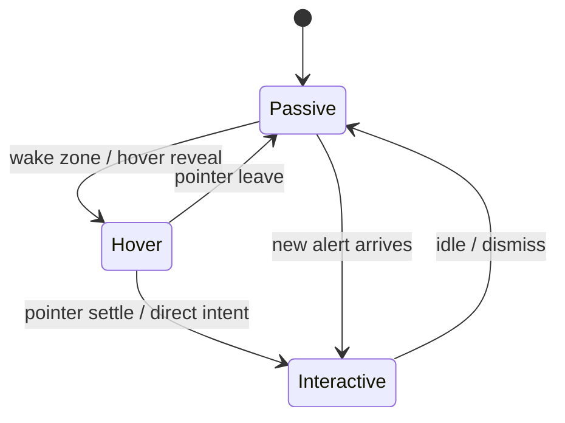

# Watch Tower v0.5 桌面行为升级需求

## Problem Frame

在 `v0.4` 把最小提醒闭环做成立之后，`watch-tower` 下一步的核心问题不再是“能不能发现并提醒新信号”，而是：

1. widget 能不能在日常桌面使用中降低打扰，而不是长期占着一块固定区域。
2. widget 能不能在需要时被可靠唤醒，而不是为了“更隐身”反而变得难以找回或难以交互。
3. 桌面高级行为能不能建立在统一状态机之上，而不是把 `auto-hide`、`hover wake`、`click-through` 和 alert 联动散落成一堆平台特判。

如果这一版直接追求完整的桌面花活，`v0.5` 很容易退化成“平台行为杂项合集”；如果完全不做桌面行为升级，widget 又会继续停留在“可用的常驻窄窗”阶段，离真正的桌面组件还有明显距离。

## Requirements

**Behavior model**
- R1. `v0.5` 必须把 widget 桌面行为收敛为单一宿主级状态机，至少包含 `passive`、`hover`、`interactive` 三种稳定状态。
- R2. `auto-hide`、`wake zone`、`hover 唤醒` 与 `passive` 低干扰形态都必须被定义为状态转换规则，而不是由不同窗口或前端局部逻辑各自推断。
- R3. 无论 widget 当前处于哪种状态，用户都必须存在一条可预期的路径回到可交互态，而不需要重启应用或依赖碰运气的鼠标操作。

**Desktop interaction**
- R4. widget 必须能够进入贴边的低干扰隐藏态，在该状态下继续承接 resident 监控职责，而不是因为隐藏而暂停数据链路。
- R5. 当 widget 处于隐藏态或 `passive` 低干扰形态时，应用必须提供稳定的唤醒方式；优先使用 `wake zone + hover`，但平台不支持时必须退化为同样可预期的替代交互。
- R6. `click-through` 只应发生在 `passive`；一旦进入 `interactive`，widget 必须保证可点击、可聚焦、可完成直接操作。
- R7. 平台能力不足时，应用必须优先保证“可恢复、可交互、不会卡死”，而不是勉强模拟完整行为后落入不可见或不可操作状态。

**Alert coordination**
- R8. `v0.5` 允许且只允许一种最小提醒协同：当新的 alert 到来且 widget 处于 `passive` 时，widget 应被提升到一次可见可交互态，确保用户有机会注意到变化。
- R9. 该提醒协同不得扩展为新的 popup 编排、未读队列管理或多 symbol 提醒系统；`v0.5` 只消费已有 alert runtime，而不重做提醒架构。

**Scope discipline**
- R10. `v0.5` 不得把 tray 或 widget 扩展成第二套主控台；group switching、复杂控制面板和提醒策略配置继续留在后续版本或现有主控台中。
- R11. `v0.5` 产物必须继续复用现有 resident runtime、共享 snapshot 和 `selectedGroupId` 语义，而不是为桌面行为再引入第二套运行时真相来源。

## Success Criteria

- widget 在日常使用中可以自动退入低干扰状态，并能被稳定唤醒，不需要用户反复调窗口位置或重新打开主窗。
- `passive -> hover -> interactive -> passive` 的主链路行为可预测，且不同状态下的点击、悬停和可见性语义不会互相打架。
- 新 alert 到来时，处于 `passive` 的 widget 会被拉起一次；但同一版不会因此演变成新的多提醒编排系统。
- 在平台不支持完整 `click-through` 或 hover 语义时，产品仍保持可恢复、可交互，不出现“看不见、点不到、唤不醒”的死态。
- 进入 `v0.6` 时，不需要推翻 `v0.4` 的 alert runtime，也不需要推翻 `v0.3` 的 resident runtime 来承接桌面行为。

## Scope Boundaries

- 不实现多 symbol popup 队列、可见上限或提醒优先级编排。
- 不实现市场总览 Grid、恢复面板或对外试用发布收尾。
- 不在 tray 或 widget 中新增 group switching。
- 不在 `v0.5` 引入复杂通知策略、alert routing 或提醒历史管理。
- 不追求 Windows 与 macOS 在底层 API 细节上的完全一致；这一版只要求交互结果可预期、可恢复。

## Key Decisions

- 采用“低风险桌面行为状态机 + 一条最小提醒联动”作为 `v0.5` 的交付方向。
  - 这意味着 `v0.5` 的主任务是把 widget 的存在感做对，而不是继续扩大提醒系统的边界。

- 优先保证“可恢复、可交互、可降级”，再追求更强的桌面魔法感。
  - 一旦平台不支持某个高级行为，fallback 应该回到稳定且可解释的交互，而不是继续堆特判。

- 把 `click-through` 限制在 `passive`，而不是贯穿所有状态。
  - 这样可以避免 widget 看起来在场、实际上却抢不到交互或吞掉用户意图。

- 新 alert 只负责把 `passive` widget 拉起一次，不承担提醒编排。
  - 这样既保留产品价值，也避免 `v0.5` 被 `v0.6` 的问题提前吞没。

## Dependencies / Assumptions

- `v0.4` 的提醒闭环已经足够稳定，适合作为 `v0.5` 唯一消费的 alert 来源。
- 当前 resident widget 继续只服务于 `selectedGroupId` 对应的单组视角，不在本版扩展为多组桌面控制器。
- 不同平台对 `dock`、`hover`、`click-through` 的支持深度可能不同，但 `v0.5` 的产品目标是交互结果一致，而不是底层机制一致。

## Alternatives Considered

- 方案 A: 直接做完整桌面行为增强版。
  - 优点是成品感强，但会快速掉进平台差异、状态抖动和复杂交互泥潭，不推荐作为当前版本主方向。

- 方案 B: 低风险桌面行为状态机 + 最小提醒联动。
  - 兼顾 daily-driver 体验和范围控制，推荐作为 `v0.5`。

- 方案 C: 把 `v0.5` 继续做成 alert-first 版本。
  - 能进一步强化提醒价值，但会让桌面行为升级失焦，并提前吞入 `v0.6` 的提醒编排问题。

## Outstanding Questions

### Resolve Before Planning

无。

### Deferred to Planning

- [Affects R5][Needs research] `wake zone` 的最小可用交互在不同平台上应如何表达，才能兼顾可发现性与低误触。
- [Affects R6][Technical] `passive` 与 `hover` 的视觉/命中区域边界应如何定义，才能避免 hover 抖动或 click-through 状态错判。
- [Affects R7][Needs research] Windows 与 macOS 各自需要哪些 fallback，才能在不支持完整桌面能力时仍保持“可恢复优先”。
- [Affects R8][Technical] 新 alert 拉起 widget 后，应以什么条件回落到 `passive`，才能既提醒到位又不制造新的常驻打扰。

## Next Steps

-> `/ce:plan` for structured implementation planning
