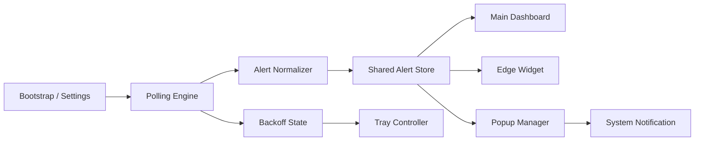

# Watch Tower 桌面端迭代路线图

## Overview

本计划面向 `watch-tower` 的桌面端 0→1 落地，目标是在当前仅有 Rust 启动骨架的基础上，分阶段交付一个可配置、可常驻、可提醒、可多窗口编排的交易信号监控桌面应用。

路线图以“先闭环、后增强”为原则推进：

1. 先完成单窗可用版本，确保 API、配置、轮询、信号渲染链路打通。
2. 再补上桌面端真正有价值的常驻能力，包括边缘 widget、托盘、系统通知和未读闭环。
3. 最后进入多窗口编排、停靠/自动隐藏/点击穿透等高复杂度行为，避免一开始就在窗口系统上失速。

建议节奏：`6 个版本 / 每版本 1-1.5 周`，单人可控；若为 2 人小团队，可将中段版本并行压缩到 `5-7 周`。

## Problem Frame

现有输入材料已经清晰定义了产品形态：

- `start.md` 定义了 API 能力、基础用户故事、轮询约束和 25 个周期的覆盖范围。
- `prd.md` 已把关键悬决问题收敛，包括 UTC+0 对齐、分组模型、已读组合键和“仅返回最新警报”的数据边界。
- `docs/tauri-multi-window-architecture.md` 已把系统拆成 `main dashboard`、`edge widget`、`alert popup`、`tray controller` 四类桌面窗口职责。
- Pencil 设计稿补全了从首启配置、主控台、滑出提醒、边缘 widget，到 dock / auto-hide / hover / click-through / multi-window orchestration 的交互细节。

因此当前最关键的问题不是“做什么”，而是“以什么顺序做，才能尽快看到一个稳定可用的桌面产品”。

## Requirements Trace

- R1. 支持用户配置 `API Key`、监控分组、周期范围、信号类型、轮询频率和提醒策略。
- R2. 支持以桌面端形式常驻，至少包含主控台、边缘 widget、托盘控制三类入口。
- R3. 支持按组展示 25 个周期的信号全览，并能渲染单级别的最近 60 根 K 线视图。
- R4. 当发现 `read=false` 的新信号时，能形成提醒闭环：自动展开 / 弹窗 / 系统通知 / 标记已读。
- R5. 轮询机制具备最小间隔保护、429/5xx 退避、异常状态可视化。
- R6. 多 symbol 不混在一个视图组内，按组管理，按 symbol 编排弹窗。
- R7. 支持后续扩展为多窗口行为：贴边、自动隐藏、观察态点击穿透、hover 唤醒、弹窗堆叠复用。

## Scope Boundaries

- 本路线图只覆盖桌面端，不包含移动端开发。
- 不包含历史信号回溯，因为服务端当前只返回“最新警报”，不保存旧信号列表。
- 不引入 WebSocket；数据同步仍以轮询为主。
- 不以“第一版就全平台完美一致”为目标；以 Windows 优先、macOS 兼容为更稳妥的推进顺序。
- 不把“可选市场总览 Grid”作为 MVP 主入口，它应晚于主控台和边缘 widget。

## Context & Research

### Relevant Code and Patterns

- 当前仓库代码极简，只有 `Cargo.toml` 与 `src/main.rs`，说明还未进入 Tauri 正式工程结构。
- `docs/tauri-multi-window-architecture.md` 已给出建议目录，可直接作为工程骨架基线：
  - `src-tauri/src/polling/*`
  - `src-tauri/src/windows/*`
  - `src-tauri/src/tray/*`
  - `src/windows/main-dashboard/*`
  - `src/windows/edge-widget/*`
  - `src/windows/alert-popup/*`
  - `src/shared/*`
- 适合优先沉淀共享层：
  - `alert-model`
  - `period-utils`
  - `events`
  - `window-state`

### Design Signals from Pencil

- `01 Bootstrap & Window Policy` 说明首启不是单纯输 Key，还要顺手完成窗口策略初始化。
- `02 Main Control Console` 说明主控台是“详情 + 队列 + 配置”的中心，而不是常驻浮窗。
- `03 Optional Market Overview Grid` 明确是可选总览，不应抢占 MVP 资源。
- `05 Slide-out Alert` 明确提醒卡片至少要承载 `symbol / period / signal`、60-bar 高亮、展开主控台、标记已读。
- `06 Edge Widget` 明确常驻 widget 必须支撑全周期纵向扫描，且一组只放一个 symbol。
- `07 Dock & Auto-hide`、`08 Hover & Click-through`、`09 Multi-window Orchestration` 说明桌面窗口行为是独立迭代面，不应与基础数据链路混做。

### Institutional Learnings

- 当前仓库中未发现 `docs/solutions/` 或既有实现经验文档，本计划以现有产品文档与设计稿作为主要依据。

### External References

- 本次规划未引入外部研究；现有需求、架构文档和设计稿已经足够支撑阶段拆解。

## Key Technical Decisions

- 决策 1：采用 `Tauri + TypeScript 前端` 的双层架构，而不是纯 Rust UI。
  - 理由：产品对多窗口、托盘、点击穿透等系统能力有要求，同时 UI 变化面很大，前端渲染层更适合承接复杂矩阵与模板展示。

- 决策 2：先交付“单主窗 + 单 widget”可用版本，再引入弹窗编排和点击穿透。
  - 理由：窗口编排是高风险桌面能力，必须建立在配置、轮询、渲染、状态同步都稳定之后。

- 决策 3：共享的数据归一化和周期换算逻辑放在 TypeScript 共享层，而不是分散在各窗口 UI。
  - 理由：主控台、widget、弹窗都要渲染同一份信号含义，避免多份周期计算逻辑漂移。

- 决策 4：轮询、退避、托盘健康状态由 Rust 侧主导。
  - 理由：它们更接近应用生命周期和系统集成层，适合作为桌面宿主职责。

- 决策 5：提醒闭环采用“前端乐观更新 + 后台回写失败回滚”的策略。
  - 理由：满足 PRD 对即时反馈的要求，同时兼顾网络失败回滚。

- 决策 6：可选市场总览 Grid 延后到产品增强阶段。
  - 理由：它提升的是浏览效率，不是主链路可用性。

## Open Questions

### Resolved During Planning

- 首期目标平台：以 Windows 为主，macOS 在窗口抽象层预留兼容位，但不要求同迭代做到完全一致。
- 迭代节奏：默认按 `6 个迭代 / 每迭代 1 周` 规划。
- 主入口优先级：边缘 widget + 主控台 > 可选总览 Grid。

### Deferred to Implementation

- 配置存储采用 `tauri-plugin-store` 还是自定义本地配置文件。
  - 原因：属于实现时选型，不改变路线图分期。

- 前端采用 `React + Vite` 还是其他轻量框架。
  - 原因：只影响实现细节，不影响能力拆解。

- 首版系统通知的声音、权限申请和不同 OS 的细微表现差异。
  - 原因：属于适配和 polish 范畴。

## High-Level Technical Design

> 本节仅用于表达方案形态，属于评审期的方向性说明，不是实现规范。

## Version Strategy

版本切分采用两个原则：

- 每个版本都必须有一个可演示的“用户价值闭环”，而不是只交付内部技术准备。
- 每个版本都只解决一类主问题，避免把数据链路、桌面窗口、提醒编排同时塞进一个版本。

建议控制在 `6 个小版本`，每版完成后都可以给内部同事或种子用户试用一轮。

## Version Roadmap

| Version | Theme | Scope | Release bar |
|------|------|------|------|
| v0.1 | 数据与宿主基座 | Tauri 工程、配置持久化、API 客户端、轮询、共享模型、调试页 | 能稳定拉取并归一化数据，具备最小可运行桌面壳 |
| v0.2 | 可配置单窗版 | 首启配置、分组管理、主控台 MVP、25 周期矩阵、60-bar 详情 | 用户能独立完成配置并在主控台完成日常查看 |
| v0.3 | 常驻监控版 | 边缘 widget、托盘控制、轮询状态可视化、主控台与 widget 联动 | 不开主控台也能扫全周期状态 |
| v0.4 | 提醒闭环版 | unread diff、滑出弹窗、系统通知、乐观已读回写、失败回滚 | 新信号能被发现、提醒、处理并同步回服务器 |
| v0.5 | 桌面行为增强版 | dock、auto-hide、hover 唤醒、click-through、窗口状态机 | widget 从静态窄窗升级为真正桌面组件 |
| v0.6 | 多窗口发布版 | 多 symbol 弹窗编排、可选总览 Grid、稳定性打磨、打包发布 | 可作为首个对外试用版本 |

## Version Breakdown

### v0.1 数据与宿主基座

**目标:** 把仓库从空骨架升级成可承载桌面应用的基础工程。

**包含范围:**
- Tauri 工程结构初始化
- API 客户端与 `x-api-key` 鉴权
- 轮询调度与最小间隔保护
- 信号归一化模型
- 25 周期排序与 UTC+0 对齐工具
- 本地配置持久化
- 一个仅供开发验证的调试页或调试窗口

**不包含:**
- 正式主控台 UI
- widget / 弹窗 / 托盘

**版本验收:**
- 能用真实接口拿到数据
- 能看见归一化后的调试结果
- 429/5xx 至少能进入 backoff 状态

### v0.2 可配置单窗版

**目标:** 交付第一个“用户真的能用”的版本。

**包含范围:**
- 首启页 `Bootstrap & Window Policy`
- API Key、分组、轮询频率、窗口策略保存
- 主控台 MVP
- 单组 25 周期矩阵
- 单级别 60-bar 时间轴详情
- 列表 / 表格两种基本布局切换

**不包含:**
- 常驻 widget
- 系统通知
- 多窗口行为

**版本验收:**
- 新用户可从零完成配置并进入主控台
- 能稳定查看至少一组 symbol 的完整周期状态

### v0.3 常驻监控版

**目标:** 让产品从“打开才看”进化为“桌面常驻可扫一眼”。

**包含范围:**
- 单个 edge widget 窗口
- 左右停靠基础能力
- 托盘菜单
- 轮询状态 / backoff 状态可视化
- 主控台与 widget 的当前 group 联动

**不包含:**
- 自动隐藏
- 点击穿透
- 新信号滑出弹窗

**版本验收:**
- 主控台隐藏后仍能通过 widget 和托盘监控
- 异常状态不只在主控台可见

### v0.4 提醒闭环版

**目标:** 让桌面应用具备真正的提醒价值。

**包含范围:**
- unread diff 检测
- 单 symbol 滑出弹窗
- 系统通知
- 标记已读
- 乐观更新与失败回滚
- 从弹窗跳转主控台详情

**不包含:**
- 多 popup 堆叠和队列
- dock / auto-hide / click-through

**版本验收:**
- 新信号不会漏报
- 同一条未读不会反复刷屏
- 已读状态能可靠同步

### v0.5 桌面行为增强版

**目标:** 把 widget 交互提升到设计稿定义的桌面体验层级。

**包含范围:**
- dock 左右切换
- auto-hide
- wake zone
- hover 唤醒
- 观察态点击穿透
- passive / hover / interactive 状态机

**不包含:**
- 多 symbol 多 popup 编排
- 可选总览 Grid

**版本验收:**
- widget 可贴边隐藏并被 hover 唤醒
- 新警报到来时隐藏状态可自动展开

### v0.6 多窗口发布版

**目标:** 完成设计稿中的多窗口编排，并收口为首个可对外试用版本。

**包含范围:**
- 多 symbol popup 复用与堆叠
- popup 可见上限与队列
- 可选市场总览 Grid
- 主控台未读队列 / 恢复面板补齐
- 安装包、README、默认权限与试用清单

**版本验收:**
- 多 symbol 告警不会互相遮挡或失控刷屏
- 应用可交付给外部试用用户安装体验

## Implementation Units

- [ ] **Unit 1: 搭建桌面工程基座与共享数据层**

**Goal:** 把当前仓库从纯 Rust 占位项目升级为可承载 Tauri 多窗口应用的基础工程，并建立统一的数据模型与 API 客户端。

**Requirements:** R1, R3, R5

**Dependencies:** None

**Files:**
- Modify: `Cargo.toml`
- Modify: `src/main.rs`
- Create: `src-tauri/Cargo.toml`
- Create: `src-tauri/tauri.conf.json`
- Create: `src-tauri/src/main.rs`
- Create: `src-tauri/src/app_state.rs`
- Create: `src-tauri/src/polling/mod.rs`
- Create: `src-tauri/src/polling/alerts_client.rs`
- Create: `src/shared/alert-model.ts`
- Create: `src/shared/period-utils.ts`
- Create: `src/shared/events.ts`
- Test: `src/shared/alert-model.test.ts`
- Test: `src/shared/period-utils.test.ts`
- Test: `src-tauri/src/polling/alerts_client.rs`

**Approach:**
- 将 API 响应统一归一化为前端和各窗口都可消费的 `group -> period -> signal state` 结构。
- 将 25 个周期的排序、文案、时间跨度、UTC+0 对齐规则沉淀到共享工具层。
- 提前定义 Rust 与前端之间的事件契约，避免后续窗口越多越难统一。

**Patterns to follow:**
- `docs/tauri-multi-window-architecture.md` 中的 `Suggested Module Layout`
- `docs/tauri-multi-window-architecture.md` 中的 `Suggested Event Contract`

**Test scenarios:**
- Happy path: 给定接口示例响应，能归一化为按 `symbol + signalType + period` 索引的模型。
- Edge case: 25 个周期的排序结果与产品要求完全一致，`W`、`D`、分钟级混排不乱序。
- Edge case: `period-utils` 在 UTC+0 日线与周线下能稳定计算最近 60 根 K 线索引。
- Error path: API 返回 `401` 时，客户端状态进入鉴权异常态，而不是静默空白。
- Error path: API 返回格式缺少某个 `signals` 字段时，归一化层能跳过异常项并保留整体结果。
- Integration: Rust 侧轮询结果可以通过事件契约送到前端共享层，无需各窗口直接请求接口。

**Verification:**
- 工程可以启动。
- 能使用测试桩或真实接口拿到数据并打印/渲染为统一模型。
- 共享模型与周期工具通过基础单元测试。

- [ ] **Unit 2: 实现首启配置流与主控台 MVP**

**Goal:** 交付用户首次可真正使用的主界面，完成 API Key、分组、轮询和窗口策略配置，并具备主控台的单组查看能力。

**Requirements:** R1, R3, R6

**Dependencies:** Unit 1

**Files:**
- Create: `package.json`
- Create: `vite.config.ts`
- Create: `src/app.tsx`
- Create: `src/windows/bootstrap/index.tsx`
- Create: `src/windows/main-dashboard/index.tsx`
- Create: `src/windows/main-dashboard/components/group-form.tsx`
- Create: `src/windows/main-dashboard/components/period-matrix.tsx`
- Create: `src/windows/main-dashboard/components/timeline-60.tsx`
- Create: `src/shared/config-model.ts`
- Test: `src/windows/main-dashboard/components/period-matrix.test.tsx`
- Test: `src/windows/main-dashboard/components/timeline-60.test.tsx`
- Test: `src/shared/config-model.test.ts`

**Approach:**
- 首屏优先按 Pencil 的 `01 Bootstrap & Window Policy` 落地，避免把窗口策略放到很后面才暴露。
- 主控台 MVP 先覆盖单组详情、周期矩阵、60-bar 视图和基础配置编辑，不急着上复杂队列与回退面板。
- 分组模型保持“一组一个 symbol”的约束，防止 UI 与数据结构都变复杂。

**Execution note:** 先做组件级测试，确保周期矩阵与 60-bar 渲染在前端层稳定后，再接入真实数据。

**Patterns to follow:**
- Pencil: `01 Bootstrap & Window Policy`
- Pencil: `02 Main Control Console`

**Test scenarios:**
- Happy path: 用户首次输入 API Key、分组配置、轮询频率后，可以保存并进入主控台。
- Happy path: 主控台能展示单组 25 个周期的当前状态，并支持列表/表格视图切换。
- Edge case: 当某周期无信号时，对应单元格显示 quiet/空态，而不是错误态。
- Edge case: 单个信号位于 60 根 K 线范围之外时，不高亮任何竖条。
- Error path: API Key 校验失败时，首启界面给出明确错误反馈，不进入空主界面。
- Integration: 编辑分组配置后，主控台与共享 store 使用同一份持久化配置重新渲染。

**Verification:**
- 新用户可以完成首次配置并进入主控台。
- 主控台可稳定呈现至少一个分组的全周期概览与 60-bar 详情。

- [ ] **Unit 3: 交付边缘 Widget MVP 与托盘控制**

**Goal:** 让应用真正具备“不开主控台也能看”的桌面常驻价值，形成主控台之外的第一视线入口。

**Requirements:** R2, R3, R5, R6

**Dependencies:** Unit 1, Unit 2

**Files:**
- Create: `src-tauri/src/windows/mod.rs`
- Create: `src-tauri/src/windows/edge_widget.rs`
- Create: `src-tauri/src/windows/positioning.rs`
- Create: `src-tauri/src/tray/mod.rs`
- Create: `src/windows/edge-widget/index.tsx`
- Create: `src/windows/edge-widget/components/period-row.tsx`
- Create: `src/windows/edge-widget/components/status-footer.tsx`
- Test: `src/windows/edge-widget/components/period-row.test.tsx`
- Test: `src-tauri/src/windows/positioning.rs`
- Test: `src-tauri/src/tray/mod.rs`

**Approach:**
- 先只支持单个 widget 窗口和基础左/右停靠，不在这一阶段引入自动隐藏和点击穿透。
- 托盘至少支持恢复主控台、暂停轮询、显示异常状态。
- widget 的 footer 直接承接轮询频率与 backoff 状态，形成 PRD 所需异常可视化。

**Patterns to follow:**
- Pencil: `06 Edge Widget`
- `docs/tauri-multi-window-architecture.md` 中的 `Edge widget window`
- `docs/tauri-multi-window-architecture.md` 中的 `Tray controller`

**Test scenarios:**
- Happy path: 应用隐藏主控台后，edge widget 仍能持续展示当前组的 25 周期状态。
- Happy path: 托盘菜单可以恢复主控台与暂停轮询。
- Edge case: 当组数大于 1 时，只展示当前选中的一个 group widget，而不是混杂多个 symbol。
- Error path: 429/5xx 触发 backoff 后，widget footer 与托盘状态同时变更。
- Integration: 主控台切换当前 group 后，widget 同步刷新展示内容。

**Verification:**
- 应用在主控台关闭或隐藏时仍可通过 widget 与托盘完成基础监控。
- backoff / paused / running 三种状态至少有可见反馈。

- [ ] **Unit 4: 打通新信号提醒闭环**

**Goal:** 实现从“轮询发现未读”到“用户处理已读”的完整通知链路，让产品真正具备提醒价值。

**Requirements:** R4, R5

**Dependencies:** Unit 1, Unit 2, Unit 3

**Files:**
- Create: `src-tauri/src/windows/alert_popup.rs`
- Create: `src-tauri/src/windows/queue.rs`
- Create: `src/windows/alert-popup/index.tsx`
- Create: `src/windows/alert-popup/components/alert-card.tsx`
- Create: `src/shared/unread-diff.ts`
- Modify: `src/shared/events.ts`
- Test: `src/shared/unread-diff.test.ts`
- Test: `src/windows/alert-popup/components/alert-card.test.tsx`
- Test: `src-tauri/src/windows/queue.rs`

**Approach:**
- 新信号检测以“本次轮询结果 vs 上次快照”的 unread diff 为准，而不是依赖 UI 状态推断。
- 弹窗 UI 先覆盖单 symbol 提醒、展开主控台、标记已读、系统通知，不在本阶段上多弹窗编排。
- 标记已读采用乐观更新，回写失败时恢复本地未读态并给出错误提示。

**Patterns to follow:**
- Pencil: `05 Slide-out Alert`
- `docs/tauri-multi-window-architecture.md` 中的 `Popup state`

**Test scenarios:**
- Happy path: 轮询发现新的 `read=false` 信号时，弹出提醒窗并触发系统通知。
- Happy path: 用户点击“标记已读”后，UI 立即消除未读标记，并在回写成功后保持稳定。
- Edge case: 同一信号重复轮询返回时，不重复制造新的提醒。
- Error path: 已读回写接口返回 `false` 或网络失败时，UI 恢复未读标记并提示失败。
- Integration: 从弹窗点击“展开主监控台”后，主控台定位到对应 group / symbol 的详情视图。

**Verification:**
- 新信号从发现、提醒、处理、同步的链路可演示。
- 不会因为重复轮询同一条未读记录而不断刷弹窗。

- [ ] **Unit 5: 实现多窗口停靠、自动隐藏、观察态点击穿透**

**Goal:** 让桌面交互进入设计稿目标形态，把 widget 从“静态窄窗”升级为真正的桌面贴边组件。

**Requirements:** R2, R4, R7

**Dependencies:** Unit 3, Unit 4

**Files:**
- Create: `src-tauri/src/windows/hover_state.rs`
- Create: `src-tauri/src/platform/mod.rs`
- Create: `src-tauri/src/platform/windows.rs`
- Create: `src-tauri/src/platform/macos.rs`
- Modify: `src-tauri/src/windows/edge_widget.rs`
- Modify: `src-tauri/src/windows/positioning.rs`
- Create: `src/shared/window-state.ts`
- Test: `src-tauri/src/windows/hover_state.rs`
- Test: `src-tauri/src/platform/windows.rs`
- Test: `src/shared/window-state.test.ts`

**Approach:**
- 把 dock / auto-hide / hover wake / click-through 当作独立状态机处理，而不是塞进 UI 组件判断。
- Windows 优先落地原生点击穿透；macOS 先预留抽象层和 no-op / fallback 行为。
- passive / hover / interactive 三态切换时，保证位置、透明度和指针事件的职责明确。

**Patterns to follow:**
- Pencil: `07 Dock & Auto-hide`
- Pencil: `08 Hover & Click-through`
- `docs/tauri-multi-window-architecture.md` 中的 `Widget state`

**Test scenarios:**
- Happy path: 左右停靠切换后，widget 会出现在正确边缘且 Y 位置稳定。
- Happy path: 开启自动隐藏时，widget 仅保留唤醒区，hover 后自动展开。
- Edge case: 鼠标离开后延时回到 passive 态，不会在用户短暂停留时频繁闪烁。
- Error path: 某平台不支持原生点击穿透时，应用回退到可交互模式并给出一致行为，而不是卡死不可点。
- Integration: 隐藏状态下收到新未读警报时，widget 自动展开并进入可感知状态。

**Verification:**
- widget 已具备贴边、自动隐藏、hover 唤醒、观察态点击穿透的完整交互。
- 同一套状态机能驱动 UI 展示与窗口宿主行为。

- [ ] **Unit 6: 完成多 symbol 弹窗编排与产品化收口**

**Goal:** 补齐多个 symbol 同时告警时的窗口管理能力，并完成可选总览与发布前稳定性工作。

**Requirements:** R2, R4, R5, R7

**Dependencies:** Unit 4, Unit 5

**Files:**
- Modify: `src-tauri/src/windows/queue.rs`
- Modify: `src-tauri/src/windows/alert_popup.rs`
- Create: `src/windows/main-dashboard/components/unread-queue.tsx`
- Create: `src/windows/main-dashboard/components/recovery-panel.tsx`
- Create: `src/windows/market-overview/index.tsx`
- Create: `src-tauri/capabilities/default.json`
- Create: `README.md`
- Test: `src-tauri/src/windows/alert_popup.rs`
- Test: `src/windows/main-dashboard/components/unread-queue.test.tsx`
- Test: `src/windows/market-overview/index.test.tsx`

**Approach:**
- 以 `symbol` 作为 popup 复用键；同 symbol 新警报刷新已有窗口，不再新增一个。
- visible popup 数量加上上限，超出部分进入队列，按 `unread newest first` 规则出队。
- 把 `03 Optional Market Overview Grid` 作为增强视图而非默认入口，只在主链路稳定后补齐。
- 收尾阶段加入安装包、基础 README、默认权限配置和试用清单。

**Patterns to follow:**
- Pencil: `03 Optional Market Overview Grid`
- Pencil: `09 Multi-window Orchestration`
- `docs/tauri-multi-window-architecture.md` 中的 `Multi-Symbol Popup Orchestration`

**Test scenarios:**
- Happy path: 不同 symbol 在短时间内连续触发未读信号时，弹窗按优先级堆叠显示。
- Happy path: 同一 symbol 再次触发时，刷新已有 popup 内容并重置可见时间。
- Edge case: 屏幕高度不足时，低优先级 popup 进入队列而不是互相遮挡。
- Error path: backoff 状态期间不应无限制造普通级别 popup。
- Integration: 主控台未读队列、popup 队列和 widget 状态对同一份告警 store 保持一致。

**Verification:**
- 多 symbol 告警在真实桌面上不重叠、不刷屏、可复用。
- 应用具备首个可试用版本所需的文档、默认配置和打包能力。

## System-Wide Impact

- **Interaction graph:** 轮询引擎、共享 store、主控台、widget、popup、tray 将通过统一事件契约耦合，最需要控制的是状态来源单一。
- **Error propagation:** 鉴权失败、限流、服务器错误必须能从 Rust 宿主层传到 tray、widget、主控台和 popup，而不是只在某一个窗口里可见。
- **State lifecycle risks:** 未读 diff、乐观已读、backoff、popup queue 都涉及“上一轮状态 vs 当前轮状态”的一致性管理，不能让窗口各自缓存真相。
- **API surface parity:** 标记已读与删除信号若后续都在 UI 暴露，应共用统一 action/rollback 模型。
- **Integration coverage:** 窗口定位、系统通知、托盘和 hover/click-through 都更适合做集成验证，而不是只靠纯组件测试。
- **Unchanged invariants:** 数据源仍然只来自轮询接口，且服务端只返回最新警报；客户端不负责构建历史 K 线信号序列。

## Risks & Dependencies

| Risk | Mitigation |
|------|------------|
| 一开始就并行做多窗口编排，导致基础链路不稳 | 严格按“单窗可用 → widget → 提醒 → 多窗口行为”推进 |
| 周期换算或 UTC+0 对齐错误，导致 60-bar 位置偏移 | 先沉淀 `period-utils` 并用测试覆盖 `D/W/分钟级` 三类场景 |
| 多窗口之间状态不一致 | 所有窗口只读共享 store，不自行拉接口 |
| 429/5xx 下不断弹提醒，造成噪音 | 在 Rust 宿主层统一 backoff，限制 popup 生成 |
| 平台差异导致点击穿透行为不可控 | 将点击穿透封装在 `platform/*` 抽象层中，先做 Windows，macOS 逐步补齐 |
| 当前仓库尚未正式 Tauri 化，首迭代范围容易失控 | 将工程搭建与共享模型视为单独里程碑，不与复杂 UI 混做 |

## Documentation / Operational Notes

- 在 Iteration 1 结束后补一份开发环境说明，避免后续进入“每个人都能跑、但谁都讲不清”的状态。
- 在 Iteration 4 结束后准备一份“提醒闭环验收清单”，覆盖新信号发现、已读回写、通知权限、失败回滚。
- 在 Iteration 6 前准备 Windows 首发试用 checklist，包括自启动、托盘退出、打包签名、异常恢复。

## Sources & References

- Origin document: `prd.md`
- Supplemental requirements: `start.md`
- Architecture: `docs/tauri-multi-window-architecture.md`
- Design boards:
  - Pencil `01 Bootstrap & Window Policy`
  - Pencil `02 Main Control Console`
  - Pencil `03 Optional Market Overview Grid`
  - Pencil `05 Slide-out Alert`
  - Pencil `06 Edge Widget`
  - Pencil `07 Dock & Auto-hide`
  - Pencil `08 Hover & Click-through`
  - Pencil `09 Multi-window Orchestration`
