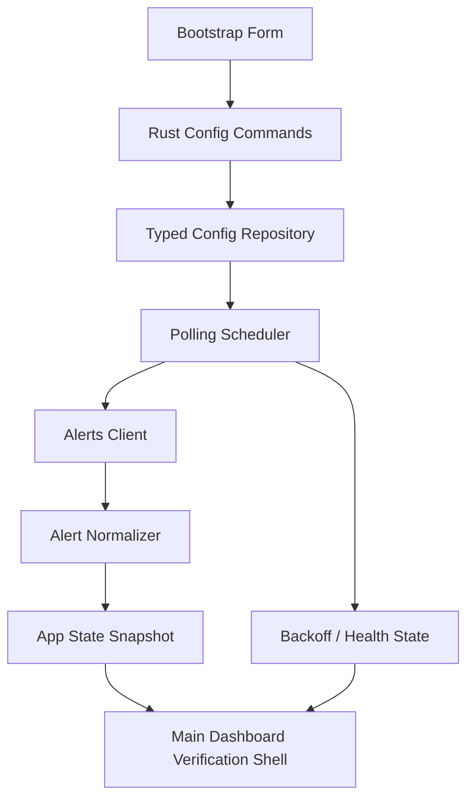

# Watch Tower v0.1 基座实施计划

## Overview

本计划只覆盖 `v0.1`，目标是把当前空仓库升级成一个可运行的 Tauri 桌面应用，并完成 `配置 -> 轮询 -> 归一化 -> 可视验证 -> 错误/退避状态` 的基础闭环。

这一版不追求正式产品体验，而是交付一个足够清晰的主窗口验证壳，让团队能够用真实 API 验证 25 周期排序、`UTC+0` 对齐、60-bar 定位和异常状态表达都已经正确，再进入 `v0.2` 的正式主控台开发。

## Problem Frame

`watch-tower` 当前只有根目录 `Cargo.toml` 与 `src/main.rs` 的 Rust 占位程序，尚未形成 Tauri 工程、前端渲染层、共享告警模型或可见的桌面应用形态。  
根据需求文档，`v0.1` 的核心不是一次做出完整桌面产品，而是先把未来所有窗口能力都依赖的底座做稳，包括：

- 可运行的桌面宿主
- 可持久化的最小配置
- 真实 API 轮询与退避
- 单组、单 symbol 视角的统一告警模型
- 可直接验证周期与时间对齐逻辑的主窗口

如果这一版跳过可见验证层，后续 `v0.2+` 会在不稳定的数据语义上叠 UI；如果这一版直接做正式主控台，则会把注意力过早带到复杂交互和视觉打磨上，偏离当前最重要的技术闭环（see origin: `docs/brainstorms/2026-04-10-watch-tower-v0-1-foundation-requirements.md`）。

## Requirements Trace

- R1. 交付一个可运行的桌面应用壳，而不是命令行或纯库层验证。
- R2. 支持最小可用配置的持久化与再次加载，配置单位为“单个 `symbol` + 一个或多个 `signalType`”。
- R3. 主窗口以“验证壳”定位承接 `v0.1`，不提前实现正式主控台交互。
- R4. 可使用 `x-api-key` 调用真实接口并按配置轮询信号数据。
- R5. 将接口结果归一化为统一的共享告警模型。
- R6. 25 周期排序与 `UTC+0` 的 60-bar 定位计算必须正确。
- R7. 轮询需要最小间隔保护，以及 `401` / `429` / `5xx` 下的显式异常与退避状态。
- R8. 验证壳以单组视角展示结果，且一个组内不混多个 `symbol`。
- R9. 主窗口能区分请求失败、归一化异常、周期换算错误与退避中等状态。
- R10. `v0.1` 产物必须能直接作为 `v0.2+` 的共享数据与宿主基础，而不是一次性调试页。

## Scope Boundaries

- 不交付 Pencil `02 Main Control Console` 的正式视觉与完整交互。
- 不实现边缘 widget、托盘、系统通知、滑出弹窗与多窗口编排。
- 不实现已读回写与删除信号接口。
- 不以“最终 UI 美感”作为 `v0.1` 验收重点；只要求主窗口验证壳信息清晰、状态可读。
- 不提前为多组、多 symbol 并排编排设计复杂窗口管理层。

## Context & Research

### Relevant Code and Patterns

- 仓库当前只有 `Cargo.toml` 与 `src/main.rs`，说明工程仍处于纯 Rust 占位阶段，没有现成的 Tauri、前端或测试模式可复用。
- `docs/tauri-multi-window-architecture.md` 已定义后续目标目录与事件分层，`v0.1` 可直接借用其中的模块边界，但只实现主窗口与共享状态相关的最小子集。
- `docs/plans/2026-04-10-001-feat-watch-tower-roadmap-plan.md` 已把 `v0.1` 定义为“数据与宿主基座”，可作为本计划的上位路线图参考。
- Pencil 里 `01 Bootstrap & Window Policy` 与 `02 Main Control Console` 明确了首屏信息结构：先完成配置，再进入单组详情视角；这与 `v0.1` 的验证壳方向一致。

### Institutional Learnings

- 当前仓库不存在 `docs/solutions/`，没有现成的机构化经验文档可复用。

### External References

- Tauri 官方“Create a Project”文档说明了 `src-tauri/` + 任意前端工具链的工程结构，适合本仓库从空骨架迁移到 `Tauri + Vite` 形态。
  - <https://v2.tauri.app/start/create-project/>
- Tauri 官方“State Management”文档说明了通过托管应用状态在 Rust 宿主层维持共享运行态，这与轮询器、健康状态、配置快照的职责划分一致。
  - <https://v2.tauri.app/develop/state-management/>
- Tauri 官方“Using Plugin Permissions”文档说明了 v2 下能力文件与权限模型的组织方式，适合在 `v0.1` 就建立清晰的宿主能力边界。
  - <https://v2.tauri.app/security/using-plugin-permissions/>
- Tauri 官方 Store 插件文档已评估，但本计划不选它作为 `v0.1` 配置主存储，因为本版本更需要 Rust 侧在 UI 启动前即可读取配置并启动轮询。
  - <https://v2.tauri.app/plugin/store/>

## Key Technical Decisions

- 决策 1：`v0.1` 采用 `Tauri v2 + React + Vite + TypeScript` 的桌面壳，而不是继续扩展根目录 Rust 占位程序。
  - 理由：当前仓库没有前端层，而 `v0.1` 需要一个可见的验证壳；React + Vite 能以较低搭建成本承接矩阵和时间轴视图，同时保留后续 `v0.2` 的演进空间。

- 决策 2：根目录 `Cargo.toml` 改为 workspace/宿主入口协调层，真正的桌面应用 Rust 代码下沉到 `src-tauri/`。
  - 理由：这与 Tauri 官方结构和后续多窗口规划一致，也能消除当前占位 crate 与正式桌面工程的职责冲突。

- 决策 3：配置持久化由 Rust 侧的 typed config repository 负责，而不是在 `v0.1` 使用 Store 插件作为主入口。
  - 理由：轮询器、未来 tray/widget 启动流程都需要在 webview 之前读取配置；由 Rust 侧持有持久化边界更符合未来宿主职责。

- 决策 4：主窗口使用 `main-dashboard` 的长期窗口标识，但在 `v0.1` 内只承载“验证壳”布局。
  - 理由：这样可以避免产出一次性 `debug-window`，并为 `v0.2` 的正式主控台保留同一入口和状态模型。

- 决策 5：退避期间保留最后一次成功快照，并叠加 stale/degraded 状态，而不是清空视图。
  - 理由：这更利于调试与使用者理解，也避免把“接口异常”误读成“当前所有信号为空”。

## Open Questions

### Resolved During Planning

- 最小配置录入方式：采用主窗口内的轻量 Bootstrap 表单，而不是要求开发者手改本地配置文件。
- `v0.1` 验证壳形态：放入单个 `main-dashboard` 窗口中，而不是拆出单独调试窗口。
- 配置主存储：采用 Rust 侧 typed config repository，前端通过命令读写。
- 主窗口状态表达：请求异常、配置缺失、退避中、最近同步成功时间，都在壳内显式展示。

### Deferred to Implementation

- 最终 HTTP 客户端与序列化细节使用何种 crate 组合。
  - 原因：这不改变模块边界，只影响实现细节。
- 验证壳中调试区的默认展开策略。
  - 原因：属于实现与可用性微调，不影响整体计划结构。
- `v0.2` 正式主控台落地时，哪些 `v0.1` 组件直接保留、哪些替换为设计稿组件。
  - 原因：属于后续版本演进决策，不阻塞 `v0.1`。

## High-Level Technical Design

> 这张图只用于表达 `v0.1` 的实现形态，属于方向性约束，不是实现规范。执行时应把它当作评审上下文，而不是逐字翻译成代码。

## Implementation Units

- [x] **Unit 1: 重构仓库为 Tauri v2 桌面工程骨架**

**Goal:** 把当前纯 Rust 占位仓库升级为可运行的 `Tauri + Vite + React` 工程，为后续共享模型与主窗口验证壳提供宿主与渲染基础。

**Requirements:** R1, R3, R10

**Dependencies:** None

**Files:**
- Modify: `Cargo.toml`
- Delete: `src/main.rs`
- Create: `package.json`
- Create: `tsconfig.json`
- Create: `vite.config.ts`
- Create: `index.html`
- Create: `src/main.tsx`
- Create: `src/app.tsx`
- Create: `src/styles.css`
- Create: `src-tauri/Cargo.toml`
- Create: `src-tauri/build.rs`
- Create: `src-tauri/tauri.conf.json`
- Create: `src-tauri/capabilities/default.json`
- Create: `src-tauri/src/main.rs`
- Create: `src-tauri/src/lib.rs`

**Approach:**
- 将根目录从“可执行 Rust 程序”调整为“前端项目 + Rust workspace 入口”的协调层，正式桌面宿主移到 `src-tauri/`。
- 一开始就使用长期窗口标签 `main-dashboard`，避免 `v0.1` 产出一次性临时窗口命名。
- 只接入主窗口运行所需的最小 Tauri 能力，不提前为 tray、notification、multi-window 打开额外能力面。

**Patterns to follow:**
- `docs/tauri-multi-window-architecture.md` 中的 `Suggested Module Layout`
- Tauri 官方项目结构：<https://v2.tauri.app/start/create-project/>

**Test scenarios:**
- Test expectation: none -- 本单元以工程脚手架和运行骨架为主，不引入独立业务逻辑；完成度通过应用可启动、前后端壳可加载来验证。

**Verification:**
- 仓库可以作为 Tauri 桌面应用启动，而不再是 `Hello, world!` Rust 占位程序。
- 主窗口能加载基础前端壳，后续单元可以在其上继续接入业务逻辑。

- [x] **Unit 2: 建立共享配置模型、告警模型与周期计算层**

**Goal:** 建立 `v0.1` 的核心语义层，明确“组配置如何表达”、“接口结果如何归一化”、“25 周期与 60-bar 如何统一计算”。

**Requirements:** R2, R5, R6, R8, R10

**Dependencies:** Unit 1

**Files:**
- Create: `src/shared/config-model.ts`
- Create: `src/shared/alert-model.ts`
- Create: `src/shared/period-utils.ts`
- Create: `src/shared/view-models.ts`
- Test: `src/shared/config-model.test.ts`
- Test: `src/shared/alert-model.test.ts`
- Test: `src/shared/period-utils.test.ts`

**Approach:**
- 配置模型明确“一组只对应一个 `symbol`，但可包含多个 `signalType`”的约束，并包含轮询频率、API Key、默认组选中信息。
- 归一化模型将接口原始返回整理为 `group -> period -> signal snapshot` 的前端友好结构，同时保留请求状态、最近同步时间与错误语义。
- 周期工具层统一沉淀 25 个周期的排序、文案、跨度换算和 `UTC+0` 的 bar index 计算，避免后续主控台、widget、popup 各自实现一套。

**Execution note:** 该单元应采用 test-first 姿势覆盖 `period-utils` 与归一化逻辑；这是 `v0.1` 里最容易出现“看起来能跑、语义却错”的区域。

**Patterns to follow:**
- `start.md` 中的 25 周期集合与接口示例
- `prd.md` 中关于 `UTC+0`、组合键、仅返回最新警报的约束
- `docs/plans/2026-04-10-001-feat-watch-tower-roadmap-plan.md` 中 `v0.1` 的共享模型意图

**Test scenarios:**
- Happy path: 给定一个包含多个 `signalType` 的单组配置，模型能正确保留单 symbol 约束与组内信号列表。
- Happy path: 给定接口示例响应，归一化结果能按 `period` 和 `signalType` 索引到当前快照。
- Edge case: 25 个周期按 `10D`、`W`、`4D`...`1` 的约定顺序输出，不因字符串排序产生错位。
- Edge case: `D`、`W` 与分钟级周期在 `UTC+0` 下都能得到稳定的 60-bar 定位结果。
- Edge case: 当单个信号时间落在最近 60 根 K 线之外时，时间轴结果返回“无高亮”而不是非法索引。
- Error path: 当接口返回某个 `signals` 字段缺失或格式异常时，归一化层跳过异常项并保留可用结果，同时打上诊断信息。
- Integration: `view-models` 能把配置模型和告警模型组合成主窗口可直接渲染的单组视图。

**Verification:**
- 共享模型测试能证明配置约束、周期排序和 60-bar 计算全部符合需求。
- 后续 Rust 轮询器和主窗口 UI 都可以直接围绕这套模型衔接，而不再重新定义语义。

- [x] **Unit 3: 实现 Rust 侧配置仓储、轮询器与健康状态桥接**

**Goal:** 让桌面宿主具备独立于 UI 的真实运行能力，包括配置加载、接口轮询、退避、错误表达，以及向前端广播统一状态快照。

**Requirements:** R2, R4, R5, R7, R9, R10

**Dependencies:** Unit 1, Unit 2

**Files:**
- Create: `src-tauri/src/app_state.rs`
- Create: `src-tauri/src/commands/mod.rs`
- Create: `src-tauri/src/config/mod.rs`
- Create: `src-tauri/src/config/repository.rs`
- Create: `src-tauri/src/polling/mod.rs`
- Create: `src-tauri/src/polling/alerts_client.rs`
- Create: `src-tauri/src/polling/scheduler.rs`
- Create: `src-tauri/src/polling/backoff.rs`
- Create: `src/shared/events.ts`
- Test: `src-tauri/src/config/repository.rs`
- Test: `src-tauri/src/polling/alerts_client.rs`
- Test: `src-tauri/src/polling/backoff.rs`
- Test: `src-tauri/src/polling/scheduler.rs`

**Approach:**
- Rust 侧持有单一 `AppState`，其中包含已加载配置、最近一次归一化快照、轮询状态、错误态与 backoff 计时信息。
- 配置读写通过命令边界暴露给前端，避免前端直接管理持久化文件格式。
- 轮询器按“最小间隔保护 -> 成功刷新 -> 写入最新快照 -> 广播事件 / 429、5xx 进入 backoff -> 保留旧快照并更新健康状态”的状态机运行。
- 事件契约只暴露 `v0.1` 当前需要的最小集合，例如 `config_loaded`、`snapshot_updated`、`polling_status_changed`、`bootstrap_required`，避免过早引入 `widget/popup` 事件。

**Patterns to follow:**
- `docs/tauri-multi-window-architecture.md` 中 Rust side responsibilities
- `docs/tauri-multi-window-architecture.md` 中 `Suggested Event Contract`
- Tauri 官方状态管理文档：<https://v2.tauri.app/develop/state-management/>

**Test scenarios:**
- Happy path: 配置存在且 API Key 有效时，宿主启动后能读取配置、发起轮询并广播最新快照。
- Happy path: 用户更新配置后，Rust 侧仓储持久化成功，轮询器使用新配置重新调度。
- Edge case: 轮询频率低于最小阈值时，仓储或调度层自动钳制到允许值，而不是按非法频率运行。
- Edge case: 应用重启后，宿主在 webview 初始化前就能读取上次保存的配置。
- Error path: API 返回 `401` 时，状态进入鉴权错误态，并停止把“空数据”当成正常结果下发。
- Error path: API 返回 `429` 或 `5xx` 时，状态进入 backoff，保留上次快照并附带重试时间。
- Error path: 配置文件损坏或缺失时，宿主回到 `bootstrap_required` 状态，而不是崩溃退出。
- Integration: `snapshot_updated` 事件负载与 `src/shared/events.ts` 的前端类型保持一致，前端无需自行拼装宿主状态。

**Verification:**
- 在没有 UI 交互的前提下，Rust 宿主已具备完整的配置加载、轮询、退避与事件广播能力。
- `401`、`429`、`5xx`、配置损坏等关键异常都能落入明确状态，而不是表现为不可解释的空白。

- [x] **Unit 4: 交付主窗口验证壳与可视诊断视图**

**Goal:** 在长期保留的 `main-dashboard` 窗口中实现 `v0.1` 的薄 UI 验证壳，让团队能够配置单组、观察矩阵与时间轴结果，并直接识别宿主运行状态。

**Requirements:** R1, R2, R3, R6, R8, R9, R10

**Dependencies:** Unit 1, Unit 2, Unit 3

**Files:**
- Modify: `src/app.tsx`
- Create: `src/windows/main-dashboard/index.tsx`
- Create: `src/windows/main-dashboard/components/bootstrap-panel.tsx`
- Create: `src/windows/main-dashboard/components/config-summary.tsx`
- Create: `src/windows/main-dashboard/components/period-matrix-debug.tsx`
- Create: `src/windows/main-dashboard/components/timeline-60-debug.tsx`
- Create: `src/windows/main-dashboard/components/polling-health-panel.tsx`
- Create: `src/windows/main-dashboard/components/diagnostics-panel.tsx`
- Create: `src/windows/main-dashboard/hooks/use-app-events.ts`
- Test: `src/windows/main-dashboard/components/bootstrap-panel.test.tsx`
- Test: `src/windows/main-dashboard/components/period-matrix-debug.test.tsx`
- Test: `src/windows/main-dashboard/components/timeline-60-debug.test.tsx`
- Test: `src/windows/main-dashboard/components/polling-health-panel.test.tsx`

**Approach:**
- 主窗口分成两个主要状态：`bootstrap required` 与 `verification shell ready`。
- Bootstrap 表单负责录入和保存最小配置；保存成功后立即请求宿主重载配置并开始轮询。
- Verification shell 展示单组配置摘要、25 周期矩阵、单周期 60-bar 时间轴、最近同步信息与错误/退避状态，不承担正式主控台的复杂筛选和布局切换。
- 诊断区显式展示“上次请求结果 / 最近同步时间 / 当前轮询状态 / backoff 到期时间 / 配置缺失原因”，让问题定位不依赖日志。
- 组件命名和结构尽量向未来主控台演进，例如保留 `main-dashboard` 路径与基础组件边界，避免形成死路。

**Patterns to follow:**
- Pencil `01 Bootstrap & Window Policy`
- Pencil `02 Main Control Console` 的信息层级，但不完整复刻视觉设计
- `docs/plans/2026-04-10-001-feat-watch-tower-roadmap-plan.md` 中 `v0.1` 与 `v0.2` 的边界定义

**Test scenarios:**
- Happy path: 首次启动时显示 Bootstrap 表单，输入有效配置后进入验证壳并展示单组结果。
- Happy path: 验证壳能显示 25 周期矩阵，且选中某周期后能在 60-bar 时间轴中看到对应高亮位置。
- Happy path: 当轮询持续成功时，健康面板显示最近同步成功时间和当前轮询频率。
- Edge case: 当某周期没有信号时，对应矩阵单元显示 quiet/empty 态，而不是错误态。
- Edge case: 只有一个 `symbol` 的组配置在主窗口内始终保持单组视角，不出现混合 symbol 内容。
- Error path: API Key 无效时，主窗口停留在可修正的错误状态，并允许用户重新保存配置。
- Error path: 宿主进入 backoff 时，主窗口保留上次成功快照，同时在健康面板与诊断区显示 degraded/stale 状态。
- Integration: `use-app-events` 收到宿主事件后，Bootstrap、矩阵、时间轴与健康面板共享同一份快照状态，不各自维护分叉缓存。

**Verification:**
- 团队可以仅通过主窗口就完成配置、观察轮询结果、确认 25 周期顺序与 60-bar 计算、识别异常类型。
- `v0.1` 结束后，这个窗口可以平滑演进成 `v0.2` 的正式主控台，而不是被整体推倒重写。

## System-Wide Impact

- **Interaction graph:** `Bootstrap Form -> Rust Commands -> Config Repository -> Polling Scheduler -> App State -> Main Dashboard` 将成为 `v0.1` 的主链路，后续 widget/tray/popup 也会共享这套宿主状态。
- **Error propagation:** `401`、`429`、`5xx`、配置损坏都必须从 Rust 宿主层透传到主窗口诊断区；任何一层吞掉错误都会让验证壳失去意义。
- **State lifecycle risks:** 快照、健康状态和配置版本必须来自单一 `AppState`，不能让前端单独推导真实状态，否则后续多窗口时代会放大状态漂移。
- **API surface parity:** `v0.1` 虽不实现已读回写，但命令与事件边界应保持可扩展，避免 `v0.4` 再推翻命令模型。
- **Integration coverage:** 仅靠纯组件测试无法证明配置保存后会重新驱动轮询，也无法证明 backoff 会正确反映到 UI，因此需要保留跨 Rust/frontend 的集成验证思路。
- **Unchanged invariants:** 数据源仍只来自当前轮询接口；服务端仍只返回最新警报；`v0.1` 不负责构建历史信号列表，也不提前引入多窗口行为。

## Risks & Dependencies

| Risk | Mitigation |
|------|------------|
| 根目录占位 Rust crate 与正式 Tauri 工程结构冲突 | 在 Unit 1 明确完成仓库重构，避免双入口长期并存 |
| 周期排序或 `UTC+0` 定位逻辑表面可用但语义错误 | 在 Unit 2 对排序与 bar index 做 test-first 覆盖 |
| 宿主错误状态没有完整映射到主窗口，导致“看起来空白但不知道为什么” | 在 Unit 3 和 Unit 4 明确要求健康状态与诊断区联动 |
| 配置持久化边界放错，导致后续 tray/widget 需要重新迁移 | 提前将配置主存储放到 Rust 侧，前端只通过命令边界操作 |
| `v0.1` 验证壳做成一次性调试页，后续无法复用 | 使用长期 `main-dashboard` 路径和组件边界，避免临时命名与死结构 |

## Documentation / Operational Notes

- `v0.1` 完成后应补充最小开发运行说明，至少覆盖本地启动方式、API Key 配置位置与调试入口说明。
- 如果在实现中发现服务端响应格式与 `start.md` / `prd.md` 不一致，应先修正文档或模型假设，再继续推进 UI。
- `v0.1` 验收时应优先用真实 API 跑一次完整链路，而不是只依赖 fixture。

## Sources & References

- Origin document: `docs/brainstorms/2026-04-10-watch-tower-v0-1-foundation-requirements.md`
- Related roadmap: `docs/plans/2026-04-10-001-feat-watch-tower-roadmap-plan.md`
- Product inputs: `prd.md`
- API input: `start.md`
- Architecture reference: `docs/tauri-multi-window-architecture.md`
- Official docs:
  - <https://v2.tauri.app/start/create-project/>
  - <https://v2.tauri.app/develop/state-management/>
  - <https://v2.tauri.app/security/using-plugin-permissions/>
  - <https://v2.tauri.app/plugin/store/>
