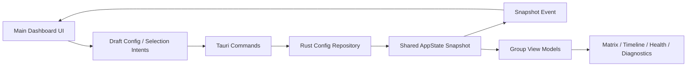

# Watch Tower v0.2 主控台补强版实施计划

## Overview

本计划只覆盖 `v0.2`，目标是把当前 `v0.1` 的“验证壳”提升为一个可长期承接配置、分组管理和状态查看的产品主控台，但仍然严格避免把大量精力投入到最终 polish。  
它的职责不是把所有桌面能力一次做完，而是为 `v0.3` 的 `single edge widget + tray` 常驻 MVP 提供稳定的配置来源、当前组选中状态和可复用的信息结构（see origin: `docs/plans/2026-04-10-001-feat-watch-tower-roadmap-plan.md`）。

## Problem Frame

`v0.1` 已经完成了最重要的基础闭环：桌面宿主、配置仓储、轮询/退避、共享模型、25 周期矩阵和 60-bar 校验都已经存在。  
但当前主窗口仍明显偏向“验证工具”而不是“产品主控台”：

- 配置录入仍以单组单 symbol 的 bootstrap 表单为中心。
- `AppConfigInput` 只支持一次性录入一个 `symbol + signalTypes`，不适合长期维护多个 group。
- 当前 UI 适合验证周期和时间轴计算，但尚未形成“分组管理 + 当前组详情 + 窗口策略设置”的长期使用信息架构。
- `v0.3` 将引入 widget 和 tray，如果 `v0.2` 不先把 group、当前组选中和窗口策略这些能力沉淀到可持久化配置中，后续常驻窗口会缺少稳定的宿主输入。

因此，`v0.2` 的正确定位不是“做出最终主控台”，而是让主控台从“验证语气”转入“产品语气”，并补齐 `v0.3` 之前必须就位的配置与状态基础。

## Requirements Trace

- R1. 用户可以在主控台中创建、编辑、删除多个监控 group，并持久化当前组选中状态。
- R2. 每个 group 继续遵守“一组只承载一个 `symbol`”的约束，但可配置多个 `signalType` 与周期。
- R3. 主控台继续展示 25 周期总览与 60-bar 详情，但其信息结构要服务于长期使用，而不是技术验证。
- R4. `API Key`、轮询频率和 `v0.3` 所需的基础窗口策略必须可持久化，并在应用重启后恢复。
- R5. 主控台需要保留并产品化现有 health / diagnostics 表达，让用户能理解 `running / polling / backoff / auth error` 等状态。
- R6. 主控台中的当前组选中、配置保存和状态快照更新必须继续通过宿主单一真相来源驱动，为后续 widget/tray 联动做准备。
- R7. 当前阶段不引入 widget、tray、popup 或高级桌面行为，但新增的配置模型必须能自然衔接这些后续能力。

## Scope Boundaries

- 不在 `v0.2` 实现 edge widget、tray controller、popup 或系统通知。
- 不在 `v0.2` 引入 `auto-hide`、`hover wake`、`click-through` 等桌面高级行为。
- 不把本阶段做成设计稿的完整视觉复刻；重点是信息架构、状态表达和配置管理完整。
- 不改变 `v0.1` 已验证的轮询/归一化语义，不重写共享模型或宿主轮询器。
- 不引入单独的第二套前端设置存储；优先在现有配置边界上收敛。

## Context & Research

### Relevant Code and Patterns

- `src/shared/config-model.ts` 当前只支持单组 bootstrap 输入，说明 `v0.2` 的第一步必须是把输入模型升级为“可编辑的长期配置模型”。
- `src/shared/alert-model.ts` 与 `src/shared/view-models.ts` 已经围绕 `selectedGroupId` 和单组归一化快照工作，说明当前主控台完全可以在既有共享模型上演进，而不需要推翻数据层。
- `src-tauri/src/app_state.rs` 与 `src-tauri/src/config/repository.rs` 已经持有完整配置快照和持久化边界，适合继续作为配置真相来源。
- `src-tauri/src/commands/mod.rs` 当前只暴露 `save_config`、`poll_now` 和 `get_bootstrap_state`，说明 `v0.2` 需要补上对“当前组选中”和更丰富配置编辑的命令支持。
- `src/windows/main-dashboard/index.tsx` 及其现有组件已经形成可复用的主页面骨架：
  - `bootstrap-panel.tsx`
  - `config-summary.tsx`
  - `polling-health-panel.tsx`
  - `diagnostics-panel.tsx`
  - `period-matrix-debug.tsx`
  - `timeline-60-debug.tsx`
- `src/windows/main-dashboard/hooks/use-app-events.ts` 已经提供宿主事件监听和浏览器 fallback，是后续主控台状态管理的自然接入点。

### Institutional Learnings

- 当前仓库不存在 `docs/solutions/`，没有现成的机构化经验文档可复用。

### External References

- 本阶段未引入额外外部研究。现有仓库模式、`v0.1` 完成状态和 roadmap 对 `v0.2` 的边界已经足够清晰，继续沿用本地模式更有价值。

## Key Technical Decisions

- 决策 1：`v0.2` 继续沿用 Rust 侧配置仓储作为唯一持久化边界，而不是引入前端本地存储。
  - 理由：`v0.3` 的 widget/tray 在 webview 之外也需要读取同一份配置；提前分裂存储只会增加迁移成本。

- 决策 2：配置编辑分为“结构性配置保存”和“轻量运行态选择同步”两类交互。
  - 理由：新增/编辑 group、窗口策略、轮询频率等适合通过完整配置保存；当前组选中切换则需要更轻的宿主同步路径，为 `v0.3` 的多窗口联动做准备。

- 决策 3：`v0.2` 的窗口策略只覆盖 `v0.3` 常驻 MVP 确定需要的基础字段。
  - 理由：例如 `dockSide`、基础尺寸/位置偏好是常驻 MVP 的输入；`auto-hide` 和 `click-through` 相关字段属于 `v0.5`，不应提前进入配置模型。

- 决策 4：主控台在视觉层面做“产品化重组”，而不是推倒重写所有 `v0.1` 组件。
  - 理由：现有矩阵、时间轴、health、diagnostics 都已经是后续长期需要的面，只是需要重新组织和重命名语气。

- 决策 5：布局预设与主控台显示偏好优先与主配置同存，而不是单独建立 dashboard-only preferences store。
  - 理由：当前阶段更看重配置收敛与实现成本控制；如果后续偏好项显著增多，再考虑拆分存储边界。

## Open Questions

### Resolved During Planning

- `v0.2` 是否需要完整复刻设计稿主控台？
  - 结论：不需要。信息架构与配置能力必须升级，但视觉 polish 只做到足够产品化即可。

- 当前组选中是否应该只存在前端本地状态？
  - 结论：不应该。它必须进入宿主可持久化状态，供后续 widget/tray 共享。

- 窗口策略是否现在就覆盖 `auto-hide/click-through`？
  - 结论：不覆盖。只纳入 `v0.3` 明确需要的基础策略字段。

### Deferred to Implementation

- `v0.2` 新增的窗口策略字段最终命名与最小集合。
  - 原因：需要在实现时结合 `v0.3` widget 创建参数做最后收口，但不影响本计划的模块边界。

- 主控台布局预设采用 tabs、segmented control 还是更轻量的切换控件。
  - 原因：属于实现细节，不改变信息架构和配置模型。

- 现有“debug”命名组件是直接重命名保留，还是以包装组件方式迁移。
  - 原因：实现时看代码摩擦度决定，不影响计划结构。

## High-Level Technical Design

> 这张图用于表达 `v0.2` 的配置与主控台关系，是方向性说明，不是实现规范。执行时应把它当作评审上下文，而不是逐字翻译成代码。

## Implementation Units

- [x] **Unit 1: 扩展配置域模型以承接多 group 与窗口策略**

**Goal:** 让当前只适合 bootstrap 的配置模型升级为长期可编辑的产品配置模型，并为 `v0.3` 提供稳定输入。

**Requirements:** R1, R2, R4, R7

**Dependencies:** None

**Files:**
- Modify: `src/shared/config-model.ts`
- Modify: `src/shared/config-model.test.ts`
- Modify: `src/shared/alert-model.ts`
- Modify: `src/shared/view-models.ts`
- Modify: `src-tauri/src/app_state.rs`
- Test: `src/shared/config-model.test.ts`

**Approach:**
- 在 TypeScript 与 Rust 两侧同步扩展 `AppConfig`，补充多 group、当前组选中和基础窗口策略字段。
- 将现有 `AppConfigInput` 从“一次性 bootstrap 输入”拆成更适合主控台编辑的结构：保留表单辅助输入模型，但新增长期配置模型与校验辅助函数。
- 继续保持每个 group 只承载一个 `symbol` 的硬约束，并确保 group ID、selected timeline period、period list 的合法性在共享模型层先被兜住。
- 让 `view-models` 支持从 richer config 构造主控台所需的 group 列表、当前 group 详情和空态信号，而不是仅面向单组验证。

**Execution note:** 先补共享模型测试，再改运行时类型，避免 UI 和 Rust 两侧同时漂移。

**Patterns to follow:**
- `src/shared/config-model.ts` 现有的 sanitize + validate 风格
- `src/shared/alert-model.ts` 中围绕 `selectedGroupId` 的归一化入口
- `docs/plans/2026-04-10-002-feat-watch-tower-v0-1-foundation-plan.md` 中 Unit 2 的共享模型边界

**Test scenarios:**
- Happy path: 给定包含多个 group 的配置，模型能正确保留当前组选中、每组单 symbol 约束与 selected timeline period。
- Happy path: 保存包含基础窗口策略的配置后，输出模型包含 `v0.3` 可直接使用的默认 dock/位置偏好字段。
- Edge case: 当 selectedGroupId 缺失或指向不存在的 group 时，模型回退到第一个合法 group，而不是抛出模糊空值。
- Edge case: 当 group 的 signalTypes 输入包含空字符串、重复值或大小写噪音时，校验层会收敛为稳定结果。
- Error path: 当某个 group 试图混入多个 symbol 或缺失 symbol 时，校验会给出明确错误，而不是生成部分非法配置。
- Integration: `view-models` 使用扩展后的配置仍能生成当前 group 的 matrix / timeline 所需数据，不破坏 `v0.1` 现有渲染入口。

**Verification:**
- `AppConfig` 已能表达 `v0.2` 主控台和 `v0.3` widget/tray 所需的最小配置面。
- 共享模型层先行吸收复杂度，后续 UI 和 Rust 只消费稳定结构。

- [x] **Unit 2: 扩展宿主命令与配置持久化以支持主控台交互**

**Goal:** 让 richer config 和当前组选中能通过宿主单一真相来源保存、恢复和广播。

**Requirements:** R1, R4, R5, R6, R7

**Dependencies:** Unit 1

**Files:**
- Modify: `src-tauri/src/commands/mod.rs`
- Modify: `src-tauri/src/app_state.rs`
- Modify: `src-tauri/src/config/repository.rs`
- Modify: `src/shared/events.ts`
- Modify: `src/windows/main-dashboard/hooks/use-app-events.ts`
- Test: `src-tauri/src/config/repository.rs`
- Test: `src-tauri/src/commands/mod.rs`

**Approach:**
- 保留现有完整配置保存路径，但扩展为接受 `v0.2` 的 richer `AppConfig`。
- 新增一个轻量命令用于切换 `selectedGroupId`，并在宿主更新后立即广播 snapshot event，避免后续 widget/tray 只能等整份配置重新保存才能同步。
- 确保 repository 对新配置结构的 round-trip 稳定，配置损坏和字段缺失仍然能回到可修复状态。
- `use-app-events` 要从“bootstrap shell”心智调整为“长期主控台会话”，支持 group 切换、配置更新和 fallback preview 一致化。

**Patterns to follow:**
- `src-tauri/src/commands/mod.rs` 现有 `save_config` / `poll_now` 边界
- `src-tauri/src/app_state.rs` 中 `AppSnapshot::from_config` 与 `update_with` 更新方式
- `src/windows/main-dashboard/hooks/use-app-events.ts` 现有的 invoke + event listen 模式

**Test scenarios:**
- Happy path: 保存多 group 配置后，应用重启仍能恢复完整配置和当前组选中状态。
- Happy path: 用户切换当前 group 时，宿主立即更新 snapshot，并让前端收到新的 selectedGroupId。
- Edge case: 当删除当前选中 group 时，宿主会回退到下一个合法 group，而不是留下悬空 selection。
- Edge case: 浏览器 fallback snapshot 能生成至少两个示例 group，供主控台 UI 在非 Tauri 环境下预览。
- Error path: 配置文件损坏或字段不完整时，宿主回到可修复状态，并向主控台暴露明确 diagnostics。
- Integration: 前端调用 group selection command 后，无需手工拼接局部状态即可从事件流收到完整快照。

**Verification:**
- 当前组选中与 richer config 已进入宿主持久化真相来源。
- `v0.3` 可以直接复用这些命令和 snapshot 语义，而不用再次拆命令模型。

- [x] **Unit 3: 将主窗口重构为产品化主控台信息架构**

**Goal:** 把当前“验证壳”主窗口重组为长期可使用的主控台，承接 group 管理、当前组详情和基础设置。

**Requirements:** R1, R2, R3, R5, R6

**Dependencies:** Unit 1, Unit 2

**Files:**
- Modify: `src/windows/main-dashboard/index.tsx`
- Modify: `src/windows/main-dashboard/components/bootstrap-panel.tsx`
- Modify: `src/windows/main-dashboard/components/config-summary.tsx`
- Modify: `src/windows/main-dashboard/components/diagnostics-panel.tsx`
- Modify: `src/windows/main-dashboard/components/polling-health-panel.tsx`
- Create: `src/windows/main-dashboard/components/group-list.tsx`
- Create: `src/windows/main-dashboard/components/group-editor.tsx`
- Create: `src/windows/main-dashboard/components/window-policy-form.tsx`
- Create: `src/windows/main-dashboard/components/dashboard-shell.tsx`
- Test: `src/windows/main-dashboard/components/bootstrap-panel.test.tsx`
- Test: `src/windows/main-dashboard/components/group-list.test.tsx`
- Test: `src/windows/main-dashboard/components/group-editor.test.tsx`
- Test: `src/windows/main-dashboard/components/window-policy-form.test.tsx`

**Approach:**
- 将页面组织改为“三块主面”：group/navigation、当前组详情、settings/health/diagnostics，而不是英雄文案 + 验证面板拼接。
- 让现有 bootstrap form 演进为“配置入口的一部分”，而不是主窗口的默认叙事中心；首次启动仍能用它，但非首次使用时它应退到设置区。
- `group-list` 负责当前组选中与概览，`group-editor` 负责创建/编辑/删除 group，`window-policy-form` 负责 `v0.3` 所需基础窗口策略。
- 保留现有 matrix / timeline / diagnostics / health 组件的核心职责，但去掉“debug shell”语气，让它们成为产品主控台的正式面板。

**Patterns to follow:**
- `src/windows/main-dashboard/index.tsx` 现有的“snapshot -> view model -> panel composition”结构
- Pencil `01 Bootstrap & Window Policy`
- Pencil `02 Main Control Console`

**Test scenarios:**
- Happy path: 已有配置用户进入主控台后，首先看到 group 列表和当前组详情，而不是被 bootstrap 心智主导。
- Happy path: 用户可从主控台新增 group、切换当前 group，并立即看到 matrix / timeline 刷新。
- Happy path: 用户修改窗口策略并保存后，主控台 summary 与 settings 区会反映最新值。
- Edge case: 当配置中没有任何 group 时，主控台显示清晰 empty state，并引导创建第一组配置。
- Edge case: 当当前组某些周期没有信号时，矩阵与时间轴继续显示 quiet/empty，而不是误导成配置错误。
- Error path: 鉴权失败或 backoff 时，health/diagnostics 仍保持在主控台可见位置，不被 settings 操作流淹没。
- Integration: 从 group-list 切换当前组后，主控台详情与 diagnostics 使用同一份 snapshot 重新渲染，不出现局部旧状态。

**Verification:**
- 主窗口已从“验证工具”转为“产品主控台”，具备长期使用的基础信息架构。
- 首次启动和日常使用共享一套页面，而不是分裂成两个几乎独立的入口。

- [x] **Unit 4: 补齐布局预设、回归覆盖与 `v0.3` 交接面**

**Goal:** 让 `v0.2` 真正达到可交付状态，而不是停留在“能编辑配置但还不稳”的中间层。

**Requirements:** R3, R4, R5, R6, R7

**Dependencies:** Unit 2, Unit 3

**Files:**
- Modify: `src/windows/main-dashboard/index.tsx`
- Modify: `src/windows/main-dashboard/components/period-matrix-debug.tsx`
- Modify: `src/windows/main-dashboard/components/timeline-60-debug.tsx`
- Create: `src/windows/main-dashboard/components/layout-preset-toggle.tsx`
- Create: `src/windows/main-dashboard/components/group-list.test.tsx`
- Create: `src/windows/main-dashboard/components/layout-preset-toggle.test.tsx`
- Create: `src/windows/main-dashboard/hooks/use-app-events.test.tsx`
- Modify: `src/windows/main-dashboard/components/period-matrix-debug.test.tsx`
- Modify: `src/windows/main-dashboard/components/timeline-60-debug.test.tsx`
- Test: `src/windows/main-dashboard/hooks/use-app-events.test.tsx`

**Approach:**
- 将 roadmap 中要求的“列表/表格布局预设与基本密度设置”收敛为明确且有限的主控台显示偏好，不做开放式可视化系统。
- 把当前 `debug` 命名的视图组件逐步转为正式主控台组件，至少在职责和测试层面完成去验证壳化。
- 为主控台状态流补上更接近用户行为的回归覆盖，尤其是 group 切换、保存配置、fallback preview 和 diagnostics 保持可见这几条路径。
- 明确记录 `v0.3` 直接可消费的配置字段与事件语义，让常驻 MVP 不需要在实现时重新发明 dashboard -> widget 的交接约定。

**Patterns to follow:**
- `src/windows/main-dashboard/components/period-matrix-debug.test.tsx` 与 `timeline-60-debug.test.tsx` 的现有组件测试结构
- `src/windows/main-dashboard/hooks/use-app-events.ts` 当前的 snapshot-driven 会话模式
- roadmap 中 `v0.2` 对“布局预设”和“基础窗口策略”的范围约束

**Test scenarios:**
- Happy path: 用户切换布局预设后，当前 group 的主视图按预期切换且偏好在重新打开应用后仍可恢复。
- Happy path: 浏览器 fallback 模式下，主控台依然能演示多 group、布局切换和当前组选中流程。
- Edge case: 只有一个 group 时，group-list 不应出现误导性的复杂管理状态，但布局切换仍可工作。
- Edge case: 当前组的 selected timeline period 与 layout preset 同时变化时，matrix / timeline 仍围绕同一组配置渲染。
- Error path: 保存配置失败时，主控台保留用户上下文并显示明确错误，而不是将 UI 重置到初始态。
- Integration: `use-app-events` 在保存配置后收到宿主返回的新 snapshot，页面各面板共享更新，不出现“设置已保存但 summary/详情未更新”的分叉状态。

**Verification:**
- `v0.2` 主控台在产品语气、配置完整性和回归覆盖上都达到可交付状态。
- `v0.3` 可以直接把 widget/tray 建立在 `v0.2` 的配置模型、selection sync 和主控台信息架构之上。

## System-Wide Impact

- **Interaction graph:** `main-dashboard` 将从单一验证窗口演进为 `group management + current group detail + settings + health` 的中心面，后续 widget/tray 都会依赖它的配置输出。
- **Error propagation:** 配置错误、鉴权错误、backoff 与 snapshot stale 状态必须继续从宿主统一透传到主控台，不允许 UI 自行猜测。
- **State lifecycle risks:** group 新增/删除、selectedGroupId 切换和 richer config 保存都可能引入悬空引用或局部旧状态，必须通过宿主完整 snapshot 回流来收敛。
- **API surface parity:** `v0.2` 新增的 selection/config commands 会成为 `v0.3` 多窗口联动的基础接口，命名和语义要尽量稳定。
- **Integration coverage:** 仅靠纯组件测试无法证明“保存配置 -> 宿主持久化 -> snapshot 更新 -> UI 全面刷新”这条链路，需要补上 hook/事件流层面的回归覆盖。
- **Unchanged invariants:** 轮询源、25 周期排序、`UTC+0` 对齐、单组单 symbol 约束和 `v0.1` 的诊断语义都不在本阶段改变。

## Risks & Dependencies

| Risk | Mitigation |
|------|------------|
| 把 `v0.2` 做成完整视觉重做项目，吞掉 `v0.3` 节奏 | 明确本阶段只做信息架构与配置能力补强，不做最终 polish |
| 在前端新增第二套偏好存储，导致宿主配置与 UI 偏好分叉 | 优先将必要偏好并入现有配置仓储 |
| group 编辑与 selectedGroupId 更新出现悬空状态 | 通过共享模型校验和宿主 snapshot 回流统一兜底 |
| 当前主控台仍保留太多“debug shell”语气，用户难以转入长期使用心智 | 在 Unit 3 明确做产品语气重组，而不只是在现有页面上继续叠控件 |
| 为未来 widget 预留过多字段，导致 `v0.2` 配置模型过度设计 | 仅纳入 `v0.3` 已确认需要的基础窗口策略字段 |

## Documentation / Operational Notes

- `v0.2` 完成后，应补充一份主控台使用说明，至少覆盖 group 管理、当前组选中、布局预设和基础窗口策略。
- `v0.2` 评审时，应以“是否足够支撑 `v0.3` widget/tray”作为第一判断标准，而不是只看主控台是否更好看。
- 如果实现过程中发现 `v0.3` 需要的窗口策略字段超出本计划假设，应优先回写计划文档，而不是临时在代码里扩散字段。

## Sources & References

- Origin document: `docs/plans/2026-04-10-001-feat-watch-tower-roadmap-plan.md`
- Related completed plan: `docs/plans/2026-04-10-002-feat-watch-tower-v0-1-foundation-plan.md`
- Product inputs: `prd.md`
- API input: `start.md`
- Architecture reference: `docs/tauri-multi-window-architecture.md`
- Related code:
  - `src/shared/config-model.ts`
  - `src/shared/alert-model.ts`
  - `src/shared/view-models.ts`
  - `src/windows/main-dashboard/index.tsx`
  - `src/windows/main-dashboard/hooks/use-app-events.ts`
  - `src-tauri/src/app_state.rs`
  - `src-tauri/src/commands/mod.rs`
  - `src-tauri/src/config/repository.rs`
