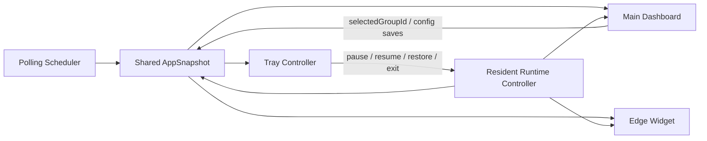

# Watch Tower v0.3 Resident Daily-Driver MVP 实施计划

## Overview

本计划只覆盖 `v0.3`，目标是在已完成的 `v0.1` 基座和 `v0.2` 主控台之上，交付一个真正可常驻桌面的 `resident daily-driver MVP`。  
这一步不追求提醒闭环、多窗口编排或高级桌面行为，而是优先验证一件事：**当主控台隐藏后，`widget + tray + shared runtime health` 是否已经足够支撑日常扫一眼使用**（see origin: `docs/plans/2026-04-10-001-feat-watch-tower-roadmap-plan.md`）。

## Problem Frame

当前仓库已经完成了配置、轮询、共享模型和主控台补强，但桌面端仍然过度依赖主窗口保持打开。  
如果下一步继续扩展主控台或直接推进提醒闭环，都会绕开最关键的产品验证：Watch Tower 作为桌面产品，是否已经具备值得常驻的独立价值。

`v0.3` 的正确定位因此不是“把多窗口架构搭出来”，也不是“把通知做完整”，而是建立一个低噪音、低 scope 的 resident loop：

- 主控台可以隐藏，但应用仍通过 widget 和 tray 持续存在。
- resident surface 复用当前 `selectedGroupId`，不再发明第二套 group orchestration。
- 轮询状态、退避、鉴权失败和 stale 语义必须在主控台之外仍然可见。
- 用户关闭主窗时，不应该意外退出整个会话；显式退出由 tray 承担。

如果这一版不能成立，后续 popup、auto-hide、click-through 和多 symbol 编排都会建立在错误的产品前提上。

## Requirements Trace

- R2. 支持桌面端常驻，至少包含主控台、edge widget、tray controller 三类入口。
- R3. 支持按组展示 25 个周期的信号总览，并可查看单级别最近 60 根 K 线映射。
- R5. 轮询机制具备最小间隔保护、`401`/`429`/`5xx` 显式状态、退避和 stale 反馈。
- R6. 一个 group 内只承载一个 `symbol`，多组由主控台进行管理，resident surface 只展示当前 selected group。
- R8. 已完成的 `v0.1` 基座和 `v0.2` 主控台产物应被直接复用和延展，而不是在后续版本中重建另一套配置、轮询或状态层。
- R9. `v0.3` 常驻 MVP 不承担提醒闭环和 group switching；它只负责把当前选中 group 变成稳定可读的桌面入口。

## Scope Boundaries

- 不在 `v0.3` 实现 popup、系统通知、已读回写或 unread queue。
- 不在 `v0.3` 引入 `auto-hide`、`hover wake`、`click-through` 或观察态状态机。
- 不在 `v0.3` 支持 tray/widget 直接切换 group；切换继续留在主控台。
- 不在 `v0.3` 引入多 widget、多 group 同时常驻或多窗口编排。
- 不改变现有 25 周期排序、`UTC+0` 对齐和 signal normalization 语义。
- 不把这一版做成外部 demo polish 项目；重点是 resident runtime 成立，而不是视觉最终态。

## Context & Research

### Relevant Code and Patterns

- `src-tauri/src/lib.rs` 当前只管理单个 `main-dashboard` 窗口和轮询调度，说明 `v0.3` 需要首次引入 resident host surfaces。
- `src-tauri/src/app_state.rs` 已经持有统一 `AppSnapshot`，适合继续作为 widget、tray 和主控台共享的单一真相来源。
- `src-tauri/src/polling/scheduler.rs` 已经能表达 `polling`、`success`、`authError`、`backoff`、`configError`、`requestError` 等状态，但还没有“手动暂停”语义。
- `src-tauri/src/commands/mod.rs` 已经提供 `save_config`、`select_group` 和 `poll_now`，说明 resident runtime 可以直接复用现有配置和 selection sync，而不用发明新命令模型。
- `src/shared/config-model.ts` 与 `src/windows/main-dashboard/components/window-policy-form.tsx` 已经沉淀了 `dockSide`、`widgetWidth`、`widgetHeight`、`topOffset` 这组 resident MVP 所需的最小窗口策略。
- `src/shared/view-models.ts` 已经能从 `AppSnapshot + selectedGroupId` 构造主控台当前 group 视图，适合扩展为 widget 专用的只读 resident view model。
- `src/windows/main-dashboard/hooks/use-app-events.ts` 已经提供 bootstrap + snapshot event 订阅模式，可作为 resident webview 的事件接入基线。
- `src-tauri/capabilities/default.json` 当前只覆盖 `main-dashboard`，而 `src-tauri/capabilities/` 下还没有其他 window-specific capability 文件。

### Institutional Learnings

- 当前仓库不存在 `docs/solutions/`，没有现成的机构化经验文档可复用。

### External References

- Tauri 官方 `System Tray` 文档确认 tray 需要在 `src-tauri/Cargo.toml` 启用 `tray-icon` 特性，并推荐使用 Rust 侧 `TrayIconBuilder` 管理菜单与事件。
  - <https://v2.tauri.app/learn/system-tray/>
- Tauri 官方 `Capabilities` 文档明确 capability 以 window label 为边界，适合为 `edge-widget` 单独分配权限。
  - <https://v2.tauri.app/security/capabilities/>
- Tauri 官方 `Capabilities for Different Windows and Platforms` 文档给出了 `WebviewWindowBuilder` 多窗口创建与分窗 capability 的推荐方式。
  - <https://v2.tauri.app/learn/security/capabilities-for-windows-and-platforms/>

## Key Technical Decisions

- 决策 1：`v0.3` 继续以 `AppSnapshot` 为 resident runtime 的唯一状态源，而不是在 tray 或 widget 中缓存第二份运行态。
  - 理由：主控台、widget 和 tray 都要表达同一份健康状态与当前组选中，状态分叉会直接破坏常驻价值。

- 决策 2：手动 `pause / resume` 必须进入宿主共享状态，而不是只作为 tray 菜单局部开关。
  - 理由：widget footer、主控台 health 面板和 tray 文案都需要同步理解“暂停”是一个正式运行态。

- 决策 3：`v0.3` 只创建一个 `edge-widget` 窗口，并始终绑定当前 `selectedGroupId`。
  - 理由：这一步要验证的是 resident loop 是否成立，而不是多窗口编排能力。

- 决策 4：主控台关闭操作在 `v0.3` 中默认转为“隐藏到 resident session”，显式退出由 tray 承担。
  - 理由：如果关闭主窗直接结束进程，resident MVP 将在最常见操作上失效。

- 决策 5：widget 的停靠和尺寸计算先保留在 Rust 自有 `positioning` 模块，不额外引入位置管理插件。
  - 理由：当前只需要 `left/right + width/height + topOffset` 的窄范围几何规则，本地模块更简单、可测且更贴合 roadmap 约束。

- 决策 6：分窗 capability 在 `v0.3` 就开始收口，而不是继续让所有未来窗口共享 `main-dashboard` 的默认能力。
  - 理由：resident surface 会长期存在，权限边界应从第一次引入新窗口时就建立清楚。

## Open Questions

### Resolved During Planning

- `v0.3` 是否要在 tray/widget 中支持 group switching？
  - 结论：不支持。resident surface 只显示当前主控台 selected group。

- `v0.3` 是否要顺手把 popup / 系统通知带上？
  - 结论：不带。提醒闭环继续留在 `v0.4`。

- `v0.3` 中主窗关闭后是退出还是隐藏？
  - 结论：隐藏进入 resident session，显式退出交给 tray。

- widget 几何管理是否需要额外引入 positioner 插件？
  - 结论：当前不需要。先用 Rust 本地定位模块覆盖左右停靠和 top offset。

### Deferred to Implementation

- tray icon 是否需要为 `running / paused / backoff / authError` 提供多套图标资源，还是首版先用单图标加菜单文案区分。
  - 原因：不改变模块边界，但会影响资源组织与 polish 成本。

- `edge-widget` 前端是走单独 HTML 入口还是沿用现有入口并按 window label 路由切换。
  - 原因：这是实现组织问题，不改变 resident runtime 的产品行为或数据契约。

- 主窗隐藏后的首次用户提示文案是否需要显式说明“应用仍在托盘常驻”。
  - 原因：属于交互提示微调，可在实现时根据实际摩擦度决定。

## High-Level Technical Design

> 这张图用于表达 `v0.3` 的 resident runtime 形态，是方向性说明，不是实现规范。执行时应把它当作评审上下文，而不是逐字翻译成代码。

## Implementation Units

- [x] **Unit 1: 扩展 resident runtime 状态层与共享契约**

**Goal:** 让宿主正式理解 resident session、手动暂停与 widget 所需的只读视图语义，而不是把这些状态散落在窗口各自的实现中。

**Requirements:** R3, R5, R6, R8, R9

**Dependencies:** None

**Files:**
- Modify: `src/shared/alert-model.ts`
- Modify: `src/shared/events.ts`
- Modify: `src/shared/view-models.ts`
- Modify: `src-tauri/src/app_state.rs`
- Modify: `src-tauri/src/polling/scheduler.rs`
- Modify: `src-tauri/src/commands/mod.rs`
- Test: `src/shared/view-models.test.ts`
- Test: `src-tauri/src/polling/scheduler.rs`
- Test: `src-tauri/src/commands/mod.rs`

**Approach:**
- 在共享状态中补上 resident MVP 需要的新运行态表达，至少包括手动 `paused` 以及 resident session 仍存活时的健康语义。
- 保持 `AppSnapshot` 仍然是唯一事件负载；不要为 widget 和 tray 另起第二种“轻量状态协议”。
- 在 `view-models` 新增一个面向 resident surface 的构造入口，让 widget 可以消费“当前 group 的 25 周期状态 + footer health”而不必复制主控台的 detail 逻辑。
- 为宿主提供最小命令或内部入口，用于 tray 触发的 `pause / resume / restore main dashboard`，同时继续复用现有 `save_config` / `select_group`。

**Execution note:** 先补状态机与命令层测试，再扩实现，避免 tray 和 widget 先依赖一个尚未稳定的运行态协议。

**Patterns to follow:**
- `src-tauri/src/app_state.rs` 中 `AppSnapshot::from_config` 与 `update_with` 的单一状态更新模式
- `src-tauri/src/polling/scheduler.rs` 现有的 `polling -> success/backoff/error` 状态推进
- `src/shared/view-models.ts` 当前的 `buildGroupViewModel` 组织方式

**Test scenarios:**
- Happy path: resident runtime 进入手动暂停后，snapshot health 变为 `paused`，并保留最后一次成功快照用于 widget 展示。
- Happy path: 从 `paused` 恢复后，调度器重新进入正常轮询周期，而不是停留在 stale 只读态。
- Edge case: 在 `backoff` 期间手动暂停，再恢复时不会丢失 `nextRetryAt` 语义或重复触发并发轮询。
- Edge case: 当前配置没有 groups 时，resident view model 继续返回清晰 empty/config error 语义，而不是抛异常。
- Error path: 在 bootstrap required 或配置损坏状态下触发 `pause / resume / restore` 不会导致 snapshot 崩坏或命令 panic。
- Integration: 主控台切换 `selectedGroupId` 后，resident view model 在下一次 snapshot 更新时切换到新 group，而无需 widget 单独请求配置。

**Verification:**
- shared snapshot 已足够表达主控台、widget 和 tray 的共同运行态。
- resident MVP 所需状态不依赖窗口局部缓存或隐式推断。

- [x] **Unit 2: 搭建单 widget + tray 的 Rust 宿主面**

**Goal:** 在宿主层创建并管理 `edge-widget` 与 tray，把主窗隐藏/恢复、停靠位置和 resident 生命周期真正落到桌面行为上。

**Requirements:** R2, R5, R6, R8, R9

**Dependencies:** Unit 1

**Files:**
- Modify: `src-tauri/Cargo.toml`
- Modify: `src-tauri/tauri.conf.json`
- Modify: `src-tauri/capabilities/default.json`
- Create: `src-tauri/capabilities/edge-widget.json`
- Create: `src-tauri/src/windows/mod.rs`
- Create: `src-tauri/src/windows/edge_widget.rs`
- Create: `src-tauri/src/windows/positioning.rs`
- Create: `src-tauri/src/tray/mod.rs`
- Modify: `src-tauri/src/lib.rs`
- Test: `src-tauri/src/windows/positioning.rs`
- Test: `src-tauri/src/tray/mod.rs`

**Approach:**
- 在 `Cargo.toml` 启用 tray 所需特性，并在 `lib.rs` 的 setup 期间完成 resident host 初始化。
- 以程序化方式创建单个 `edge-widget` 窗口，窗口 label 保持稳定，几何规则由 `positioning.rs` 统一计算。
- tray 先只承接 `restore main dashboard`、`pause/resume polling`、显示当前运行态和 `quit` 这组最小操作，不扩展到 group switching。
- 主窗 close request 不直接结束应用，而是转为隐藏；显式退出由 tray 触发。
- capability 文件按 window label 拆分，避免 `edge-widget` 无差别继承未来主控台权限面。

**Patterns to follow:**
- `docs/tauri-multi-window-architecture.md` 中 `edge widget`、`tray controller` 与 `positioning` 的职责拆分
- `src-tauri/src/lib.rs` 当前 `setup -> manage shared state -> spawn scheduler` 的宿主启动顺序
- Tauri 官方多窗口与 capability 分窗建议

**Test scenarios:**
- Happy path: 应用启动后在配置存在的情况下创建 `edge-widget` 和 tray，主窗隐藏后 resident surfaces 仍然存在。
- Happy path: tray 触发 `restore main dashboard` 时，主窗从隐藏态恢复到前台而不重建共享状态。
- Happy path: tray 触发 `pause` 与 `resume` 时，菜单文案和共享 snapshot 状态同步变化。
- Edge case: `dockSide=left` 与 `dockSide=right` 时，widget 的 `x/y` 位置计算都符合 `widgetWidth/widgetHeight/topOffset` 规则。
- Edge case: 配置中的 widget 尺寸大于当前显示区域时，定位逻辑会做最小安全约束，而不是生成不可见或越界窗口。
- Error path: widget 创建失败或 tray 初始化失败时，主窗仍能继续运行并暴露明确 diagnostics，而不是让应用直接无提示退出。
- Integration: 主窗 close request 被拦截后，应用进入 hidden-but-running 状态；只有 tray `quit` 会真正结束应用。

**Verification:**
- 宿主已经能管理 resident session，而不是只有一个普通主窗口。
- 单 widget + tray 的桌面存在感在不打开主控台时也成立。

- [x] **Unit 3: 交付 edge widget 前端与 resident snapshot 订阅**

**Goal:** 让 `edge-widget` 作为一个独立 webview，稳定呈现当前 selected group 的 25 周期总览与 footer health。

**Requirements:** R2, R3, R5, R6, R8, R9

**Dependencies:** Unit 1, Unit 2

**Files:**
- Create: `src/windows/edge-widget/index.tsx`
- Create: `src/windows/edge-widget/hooks/use-edge-widget-events.ts`
- Create: `src/windows/edge-widget/components/period-row.tsx`
- Create: `src/windows/edge-widget/components/status-footer.tsx`
- Create: `src/windows/edge-widget/components/empty-state.tsx`
- Modify: `src/app.tsx`
- Modify: `src/shared/view-models.ts`
- Test: `src/windows/edge-widget/components/period-row.test.tsx`
- Test: `src/windows/edge-widget/components/status-footer.test.tsx`
- Test: `src/windows/edge-widget/hooks/use-edge-widget-events.test.tsx`

**Approach:**
- 让 widget 只消费 resident view model，不复用主控台的 detail-heavy 结构；它的职责是快速扫一眼，而不是 drill-down。
- resident webview 继续使用 `get_bootstrap_state + APP_SNAPSHOT_EVENT` 这条现有事件链，而不是再引入轮询或配置读取的前端副本。
- widget 内容聚焦 25 周期矩阵压缩表达和 footer health，明确展示 `running / paused / backoff / auth error / stale`。
- 对于 `bootstrapRequired`、`no groups`、`configError` 等场景，widget 必须有清晰但轻量的 empty/error 表达，而不是静默空白。

**Patterns to follow:**
- `src/windows/main-dashboard/hooks/use-app-events.ts` 现有的 bootstrap + event listen 模式
- `src/shared/view-models.ts` 当前围绕 selected group 构建只读 view model 的方式
- `src/windows/main-dashboard/components/polling-health-panel.tsx` 中已有的健康状态文案基线

**Test scenarios:**
- Happy path: 当 snapshot 有当前 selected group 数据时，widget 渲染完整 25 周期状态与 footer health。
- Happy path: 主控台切换 `selectedGroupId` 后，widget 在收到新的 snapshot 时切到新 group 而不需要重载窗口。
- Edge case: 某些周期没有 signal 时，widget 对应单元显示 quiet/empty，而不是误导成错误状态。
- Edge case: `paused` 或 `backoff` 状态下，widget 保留最后一次成功快照并在 footer 清晰提示当前运行态。
- Error path: `authError`、`bootstrapRequired` 或 `configError` 时，widget 不显示伪造的行情矩阵，而是展示可理解的恢复指引。
- Integration: 非 Tauri fallback 环境下，widget hook 仍能使用 mock snapshot 预览 resident 布局，便于组件开发与测试。

**Verification:**
- widget 已能作为独立入口呈现当前 group 的桌面监控价值。
- resident surface 的前端逻辑不依赖主控台组件局部状态。

- [x] **Unit 4: 打通主控台 handoff、回归覆盖与验收清单**

**Goal:** 让 `v0.3` 从“技术上能显示 widget”提升为“主窗隐藏后可稳定日常使用”的可交付 resident loop。

**Requirements:** R2, R5, R6, R8, R9

**Dependencies:** Unit 2, Unit 3

**Files:**
- Modify: `src/windows/main-dashboard/index.tsx`
- Modify: `src/windows/main-dashboard/hooks/use-app-events.ts`
- Modify: `src/windows/main-dashboard/components/window-policy-form.tsx`
- Modify: `src/windows/main-dashboard/components/polling-health-panel.tsx`
- Modify: `src/windows/main-dashboard/index.test.tsx`
- Create: `src/windows/main-dashboard/hooks/use-app-events.test.tsx`
- Create: `docs/checklists/v0-3-resident-acceptance.md`

**Approach:**
- 在主控台中明确 resident runtime 已启用的产品心智，例如窗口策略保存后会驱动 widget/tray，而不是停留在“未来能力预设”。
- 让主控台 health 面板与 resident runtime 共享同一套 `paused/backoff/authError/stale` 语义，避免主窗和 tray/widget 各说各话。
- 补齐 close-to-tray、restore-from-tray、pause/resume 相关的回归覆盖，确保这些行为不是只在 Rust 层“理论存在”。
- 在计划文档之外补一份最小验收清单到实现说明或评审备注中，确保 `v0.3` 以 resident daily-driver 标准验收，而不是只看窗口是否出现。

**Patterns to follow:**
- `src/windows/main-dashboard/index.tsx` 当前的 snapshot-driven dashboard 组合方式
- `src/windows/main-dashboard/index.test.tsx` 与 `use-app-events.test.tsx` 的 UI + hook 回归风格
- roadmap 中对 `v0.3` “不做 notifications、不做 group switching”的范围约束

**Test scenarios:**
- Happy path: 用户保存窗口策略后，主控台摘要与 resident runtime 使用同一份配置值。
- Happy path: 主窗被关闭后，tray 仍可恢复主控台且恢复后不丢失当前 group 与 health 信息。
- Edge case: 用户在 `paused` 状态下从主控台触发 `poll now` 或切换 group 时，不会把 resident runtime 推入不一致状态。
- Edge case: 首次进入 resident 模式的用户能在主控台看到清晰提示，知道关闭主窗不会退出应用。
- Error path: resident runtime 初始化失败时，主控台 health/diagnostics 能反映“主窗仍可用但 resident surface 降级”的状态。
- Integration: widget、tray 和主控台围绕同一份 snapshot 更新，不出现“tray 显示 paused、主控台仍显示 polling”的分叉状态。

**Verification:**
- `v0.3` 的验收标准从“窗口出现了”升级为“主窗隐藏后仍可稳定日常使用”。
- 主控台与 resident surfaces 对同一运行态保持一致解释。

## System-Wide Impact

- **Interaction graph:** `main-dashboard` 不再是唯一入口；resident runtime 会引入 `main-dashboard <-> shared snapshot <-> edge-widget/tray` 的三面同步关系。
- **Error propagation:** resident 初始化失败、tray 事件失败、窗口创建失败等宿主错误必须继续回流到统一 diagnostics，而不是只打印日志。
- **State lifecycle risks:** `paused`、`backoff`、`authError`、`hidden main window` 这些状态可能交叉出现，必须由共享状态层统一收敛，避免窗口各自推断。
- **API surface parity:** `AppSnapshot`、`shared/events.ts` 和命令边界一旦扩展，将同时影响主控台与 resident webview；任何命名漂移都会扩大返工面。
- **Integration coverage:** 仅靠纯组件测试无法证明 close-to-tray、restore、pause/resume 与轮询器协作成立，需要 Rust 层和 hook 层都补回归。
- **Unchanged invariants:** `v0.3` 不改变 signal normalization、25 周期集合、单组单 symbol 约束，也不引入 unread/popup 语义。

## Risks & Dependencies

| Risk | Mitigation |
|------|------------|
| 手动暂停只是 tray 局部状态，导致 widget 和主控台仍显示运行中 | 在 Unit 1 将 `paused` 提升为共享 snapshot 正式状态 |
| 主窗关闭直接结束进程，导致 resident MVP 最常见路径失效 | 在 Unit 2 明确 close-to-tray，显式退出收敛到 tray |
| `edge-widget` 复制主控台逻辑，后续出现第二套 view model 漂移 | 在 Unit 1/3 用 shared resident view model 收口 |
| tray / widget 初始化失败会让整个应用无提示退出 | 宿主错误回流 diagnostics，主控台保留可恢复入口 |
| capability 仍然按单窗口时代处理，未来 resident surfaces 权限边界不清 | 从 `v0.3` 开始按 window label 建立 capability 文件 |

## Documentation / Operational Notes

- `v0.3` 评审时，应优先按“主窗隐藏后是否仍值得每天开着”来判断，而不是按“多窗口架构是否更完整”来判断。
- 进入执行前，应准备一份 resident 验收清单，至少覆盖隐藏主窗、恢复主窗、暂停/恢复轮询、backoff/authError/stale 外显四条路径。
- 若实现中发现 tray/widget 强烈需要 group switching，必须先回写 roadmap 与本计划再扩 scope，而不是在执行中默默加码。

## Sources & References

- Origin document: `docs/plans/2026-04-10-001-feat-watch-tower-roadmap-plan.md`
- Related completed plans:
  - `docs/plans/2026-04-10-002-feat-watch-tower-v0-1-foundation-plan.md`
  - `docs/plans/2026-04-11-003-feat-watch-tower-v0-2-main-dashboard-plan.md`
- Architecture reference: `docs/tauri-multi-window-architecture.md`
- Related code:
  - `src-tauri/src/lib.rs`
  - `src-tauri/src/app_state.rs`
  - `src-tauri/src/polling/scheduler.rs`
  - `src-tauri/src/commands/mod.rs`
  - `src/shared/config-model.ts`
  - `src/shared/alert-model.ts`
  - `src/shared/view-models.ts`
  - `src/windows/main-dashboard/hooks/use-app-events.ts`
  - `src/windows/main-dashboard/components/window-policy-form.tsx`
- External docs:
  - <https://v2.tauri.app/learn/system-tray/>
  - <https://v2.tauri.app/security/capabilities/>
  - <https://v2.tauri.app/learn/security/capabilities-for-windows-and-platforms/>
