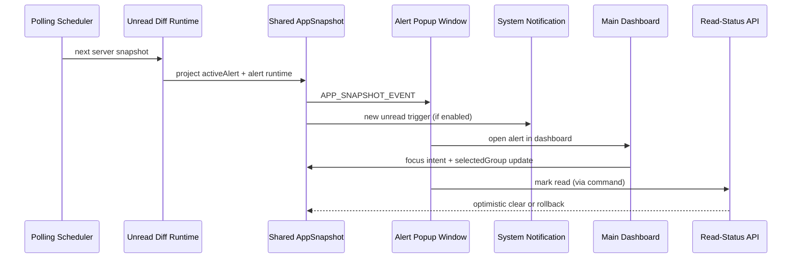

# Watch Tower v0.4 Minimal Alert Closure MVP 实施计划

## Overview

本计划只覆盖 `v0.4`，目标是在已完成的 `v0.1` 基座、`v0.2` 主控台和 `v0.3` resident loop 之上，交付一个克制但可靠的提醒闭环。  
这一步不追求多 popup 编排、复杂静音策略或高级桌面行为，而是优先验证一件事：**当新的 `read=false` 信号出现时，Watch Tower 能否可靠地发现、提醒、引导用户处理，并把结果稳定回写**（see origin: `docs/plans/2026-04-10-001-feat-watch-tower-roadmap-plan.md`）。

## Problem Frame

当前仓库已经证明 Watch Tower 可以在主窗隐藏后继续通过 `widget + tray` 常驻桌面，但它仍然偏向“被动扫一眼”的监控产品。  
如果下一步直接推进 `auto-hide`、`click-through` 或多窗口编排，会继续强化桌面存在感，却绕开当前最核心的产品缺口：**新信号出现时，产品能否可靠地主动叫到用户，并让用户完成处理闭环。**

`v0.4` 的正确定位因此不是“把提醒架构彻底做完”，也不是“把桌面行为打磨完整”，而是建立一个最小可用、低噪音、单一真相来源的 alert closure loop：

- unread diff 必须由宿主统一判定，而不是让各窗口各自推断。
- popup 与系统通知必须对同一条未读只提醒一次，避免刷屏。
- 用户从提醒进入主控台后，能直接看到对应 group / period / signalType 的上下文。
- 已读回写必须支持乐观更新与失败回滚，但不能让服务端原始快照语义丢失。

如果这一版不能成立，后续多 popup 队列、桌面行为增强和试用发布都会建立在不稳定的提醒前提上。

## Requirements Trace

- R1. 支持用户配置 `API Key`、监控分组、周期范围、信号类型、轮询频率和基础窗口策略。
- R2. 支持桌面端常驻，至少包含主控台、edge widget、tray controller 三类入口。
- R4. 当发现 `read=false` 的新信号时，支持提醒闭环：检测、通知、跳转、标记已读、失败回滚。
- R5. 轮询机制具备最小间隔保护、`401`/`429`/`5xx` 显式状态、退避和 stale 反馈。
- R6. 一个 group 内只承载一个 `symbol`，多组由主控台进行管理，resident surface 只展示当前 selected group。
- R8. 已完成的 `v0.1`、`v0.2`、`v0.3` 产物应被直接复用和延展，而不是在后续版本中重建另一套配置、轮询、resident 或提醒状态层。
- R9. `v0.4` 提醒 MVP 不承担高级桌面行为、group switching 或多 popup 编排；它只负责把当前 resident 产品推进到可靠的提醒闭环。

## Scope Boundaries

- 不在 `v0.4` 引入多 popup 队列、可见上限或同屏编排策略；但允许宿主维护单窗口所需的最小 backlog，避免同轮新未读被静默丢失。
- 不在 `v0.4` 引入 `auto-hide`、`hover wake`、`click-through` 或 widget 状态机。
- 不在 `v0.4` 支持 tray/widget 直接切换 group；group selection 继续留在主控台。
- 不在 `v0.4` 引入复杂静音策略；只提供单一开关级别的系统通知控制。
- 不改变现有 25 周期排序、`UTC+0` 对齐、单组单 symbol 约束和 resident widget 的当前组选中语义。
- 不把这一版做成外部 demo polish 项目；重点是提醒闭环成立，而不是视觉或动画最终态。

## Context & Research

### Relevant Code and Patterns

- `src-tauri/src/app_state.rs` 当前持有统一 `AppSnapshot`，并已在 `runtime` 中表达 `pollingPaused` 与 `lastActiveStatus`；这是扩展提醒运行态的自然落点。
- `src-tauri/src/polling/scheduler.rs` 已拥有轮询成功、失败、backoff 和 resident surface 同步的主循环；unread diff 最适合在这里与服务端快照衔接。
- `src-tauri/src/polling/alerts_client.rs` 已封装信号查询请求与错误分类，适合在同层补入 `read-status` 写回客户端。
- `src-tauri/src/commands/mod.rs` 已承接 `save_config`、`select_group`、`poll_now`、`pause_polling` 和 `resume_polling`；提醒相关 UI 行为应继续通过命令边界进宿主，而不是直接从前端请求接口。
- `src-tauri/src/windows/mod.rs` 与 `src-tauri/src/windows/edge_widget.rs` 已验证程序化多窗口创建与 resident surface 生命周期，适合作为 `alert-popup` 窗口的实现模式。
- `src/app.tsx` 当前按 window label 在 `main-dashboard` 与 `edge-widget` 间路由；`alert-popup` 可以沿用相同分窗入口模式。
- `src/windows/main-dashboard/hooks/use-app-events.ts` 与 `src/windows/edge-widget/hooks/use-edge-widget-events.ts` 已建立 `get_bootstrap_state + APP_SNAPSHOT_EVENT` 的订阅模式；popup 页面也应沿用同一事件链，而不是自建数据获取副本。
- `src/shared/view-models.ts` 当前同时服务 dashboard 与 widget；新增 popup 专用 view model 和 dashboard focus intent 会比在组件里散写映射更稳。
- `src/shared/config-model.ts` 已作为持久化配置的单一前端契约；通知开关若需要持久化，应继续走这里而不是额外 local storage。

### Institutional Learnings

- 当前仓库不存在 `docs/solutions/`，没有现成的机构化经验文档可复用。

### External References

- Tauri v2 Notification plugin 官方文档说明了桌面通知的接入方式和权限边界，适合用于 `v0.4` 的系统通知实现。
  - <https://v2.tauri.app/plugin/notification/>
- Tauri v2 multi-window 文档与当前 `edge-widget` 实现一致，继续适合作为 `alert-popup` 分窗模式的参考。
  - <https://v2.tauri.app/learn/window-customization/>
- `docs/tauri-multi-window-architecture.md` 已给出 `alert popup`、`edge widget` 与 `tray controller` 的职责拆分，应继续作为本计划的本地架构约束。

## Key Technical Decisions

- 决策 1：提醒判定覆盖所有已配置 groups，而不是只覆盖当前 `selectedGroupId`。
  - 理由：轮询请求当前已按所有 groups 做 union；如果提醒只看当前 group，会让非选中 group 的监控价值失真。

- 决策 2：unread diff 由 Rust 宿主在轮询主循环中统一判定，而不是由 dashboard、widget 或 popup 前端各自从 snapshot 推断。
  - 理由：popup、系统通知和 resident surfaces 都依赖同一份“新未读”判断，宿主是唯一能同时看到轮询前后服务端快照的位置。

- 决策 3：服务端原始响应继续作为提醒判定基线，乐观已读不直接篡改“上一轮服务端快照”。
  - 理由：如果把乐观已读直接写回 diff 基线，会把“本地 optimistic overlay”与“服务端事实”混在一起，增加重复提醒与失败回滚的歧义。

- 决策 4：`v0.4` 只维护一个活动 popup 语义，不提前引入多 popup 队列。
  - 理由：这一步要验证的是提醒闭环是否可靠，而不是多窗口编排能力。

- 决策 5：`v0.4` 允许宿主维护单窗口所需的最小待处理 backlog，但不把它扩展成多 popup 编排系统。
  - 理由：如果同轮出现多条新未读，提醒 MVP 不能静默丢失其中一部分；但这不等于要提前做可见队列和多窗口 orchestration。

- 决策 6：从 popup 打开主控台时，宿主需要同时完成 `selectedGroupId` 切换、主窗恢复和 alert focus intent 投递。
  - 理由：如果只恢复主窗而不携带上下文，用户仍需要手动重新定位到对应 group / period / signalType，提醒闭环就不完整。

- 决策 7：系统通知开关进入持久化配置，但保持单一布尔开关，不在 `v0.4` 引入频道、静音时段或按 signalType 细分策略。
  - 理由：提醒 MVP 需要最小可用的噪音控制，但不应因此膨胀出完整通知中心。

## Open Questions

### Resolved During Planning

- `v0.4` 的提醒范围是否只覆盖当前 selected group？
  - 结论：不只覆盖当前 selected group。提醒应覆盖所有已配置监控 groups，但 popup 打开主控台时会聚焦到对应 group。

- unread diff 应该放在前端 shared helper 还是宿主轮询层？
  - 结论：放在宿主轮询层，由 Rust 统一判定；前端只消费投影后的 alert runtime 与 popup view model。

- 乐观已读是否直接改写服务端快照中的 `read` 字段？
  - 结论：不直接改写 diff 基线；通过单独的 optimistic overlay / pending-write 语义表达本地处理态。

- `v0.4` 是否要顺手实现多 popup 编排？
  - 结论：不做。只保留单活动 popup 语义，但宿主可保留最小 backlog，确保同轮新未读不会丢失；多 symbol 编排继续留到 `v0.6`。

### Deferred to Implementation

- `alert-popup` 是否沿用当前 `index.html + window label` 路由，还是拆独立 HTML 入口。
  - 原因：这是前端组织方式，不改变提醒闭环的产品行为或数据契约。

- Windows 上系统通知在开发态与安装包态的体验差异是否需要额外 fallback 文案。
  - 原因：这需要结合 Tauri 插件实际行为验证，属于执行期验证问题。

- popup 自动隐藏的具体超时时长与“点击外部即关闭”交互细节。
  - 原因：这是实现期交互调优，不影响当前架构边界与核心闭环。

## High-Level Technical Design

> 这张图用于表达 `v0.4` 的提醒闭环形态，是方向性说明，不是实现规范。执行时应把它当作评审上下文，而不是逐字翻译成代码。

## Implementation Units

- [x] **Unit 1: 扩展 alert runtime 状态层与 unread diff 契约**

**Goal:** 让宿主正式理解“新未读 alert”“活动 popup”“乐观已读 overlay”和“dashboard focus intent”这些 `v0.4` 核心语义，而不是把提醒状态散落在各窗口自己的局部缓存中。

**Requirements:** R4, R5, R8, R9

**Dependencies:** None

**Files:**
- Modify: `src-tauri/src/app_state.rs`
- Create: `src-tauri/src/polling/unread_diff.rs`
- Modify: `src-tauri/src/polling/mod.rs`
- Modify: `src/shared/alert-model.ts`
- Modify: `src/shared/view-models.ts`
- Modify: `src/shared/events.ts`
- Test: `src-tauri/src/polling/unread_diff.rs`
- Test: `src/shared/alert-model.test.ts`
- Test: `src/shared/view-models.test.ts`

**Approach:**
- 在 `AppSnapshot` 中增加最小 alert runtime 投影，至少能表达：
  - 当前活动 alert payload
  - 是否存在待确认的乐观已读
  - dashboard 需要消费的 focus intent 或等价语义
  - 通知开关的当前配置值
- 新建宿主侧 unread diff helper，基于“上一轮服务端快照 + 本轮服务端快照 + 本地 optimistic overlay”计算是否出现新的未读。
- 让 alert runtime 在单活动 popup 之外保留最小待处理 backlog，确保同轮或连续轮询到来的新未读不会因为单窗口策略而被覆盖丢失。
- 保持服务端快照与本地 optimistic 语义分层，避免把“已读回写中”混成“服务端已读”。
- 在 shared view models 中新增 popup 专用视图构造入口，以及 dashboard 用于消费 focus intent 的最小映射。

**Execution note:** 先把 diff 规则与 optimistic overlay 的测试钉住，再扩调度器和窗口行为，避免后续 popup/notification 建在模糊语义上。

**Patterns to follow:**
- `src-tauri/src/app_state.rs` 中 `AppSnapshot::from_config` 与 `update_with` 的单一状态更新模式
- `src-tauri/src/polling/scheduler.rs` 现有的“轮询完成后整体替换 / 更新 snapshot”方式
- `src/shared/view-models.ts` 当前围绕 dashboard 与 widget 构建只读 view model 的组织方式

**Test scenarios:**
- Happy path: 同一信号键从“上轮不存在或已读”变为“本轮 unread”时，diff 返回一个新的活动 alert。
- Happy path: 同一未读在后续轮询中继续保持 unread 时，不会被重复判定为新 alert。
- Edge case: 两个不同 group 的 signal 在同一轮同时变为 unread 时，runtime 保留一个活动 popup，同时把剩余新 alert 保留在最小 backlog 中而不丢失。
- Edge case: 本地存在待确认的 optimistic read 时，view model 对 UI 显示为已处理，但 diff 基线仍保持服务端事实不漂移。
- Error path: 回写失败后清除 optimistic overlay，alert runtime 重新变为可见待处理状态。
- Integration: dashboard focus intent 被写入 snapshot 后，主控台和 popup 看到的是同一条目标 alert 上下文，而不是两套不同 payload。

**Verification:**
- shared snapshot 已足够表达 popup、系统通知和主控台 handoff 需要的共同提醒语义。
- unread diff 规则不依赖任何单窗口局部缓存或前端推断。

- [x] **Unit 2: 接入宿主提醒链路与已读回写命令**

**Goal:** 让 Rust 宿主拥有完整的提醒执行骨架，包括 `read-status` API、popup 窗口生命周期、系统通知触发和主控台定向恢复。

**Requirements:** R1, R2, R4, R5, R8, R9

**Dependencies:** Unit 1

**Files:**
- Modify: `src-tauri/Cargo.toml`
- Modify: `src-tauri/src/lib.rs`
- Modify: `src-tauri/src/polling/alerts_client.rs`
- Modify: `src-tauri/src/polling/scheduler.rs`
- Modify: `src-tauri/src/commands/mod.rs`
- Modify: `src-tauri/src/windows/mod.rs`
- Create: `src-tauri/src/windows/alert_popup.rs`
- Create: `src-tauri/capabilities/alert-popup.json`
- Test: `src-tauri/src/polling/alerts_client.rs`
- Test: `src-tauri/src/commands/mod.rs`
- Test: `src-tauri/src/windows/alert_popup.rs`

**Approach:**
- 在 `alerts_client.rs` 新增 `read-status` 请求封装，并复用现有 `x-api-key` 与错误分类风格。
- 在 `scheduler.rs` 成功轮询后挂接 unread diff 逻辑，统一决定：
  - 是否创建 / 更新活动 popup
  - 是否推进最小 backlog 中的下一个待处理 alert
  - 是否触发系统通知
  - 是否保持最后一个活动 alert 直到用户处理或明确关闭
- 新增宿主命令用于：
  - 标记指定 alert 已读
  - 打开指定 alert 对应的主控台详情
  - 切换系统通知开关
- `alert_popup.rs` 复用 `edge_widget.rs` 的程序化建窗模式，但保持独立 label、尺寸和显示/隐藏策略。
- 系统通知在 Rust 侧触发，确保提醒判定与通知发送都建立在同一份宿主状态之上。

**Patterns to follow:**
- `src-tauri/src/polling/alerts_client.rs` 当前的 endpoint / error 分类风格
- `src-tauri/src/windows/edge_widget.rs` 的多窗口创建与复用模式
- `src-tauri/src/commands/mod.rs` 当前“命令更新 snapshot -> emit -> sync resident surfaces”的命令边界

**Test scenarios:**
- Happy path: 轮询返回一个新 unread alert 时，scheduler 将其投影为活动 popup，并在通知开关开启时触发系统通知。
- Happy path: 当前活动 alert 被处理或关闭后，如果 backlog 中仍有待处理 alert，scheduler / runtime 会推进下一个 alert 成为活动 popup。
- Happy path: popup 中的“标记已读”命令触发后，宿主先写入 optimistic overlay，再调用 `read-status` 接口。
- Happy path: “在主控台打开”命令会恢复主窗、切换到对应 group，并发出目标 alert 的 focus intent。
- Edge case: 通知开关关闭时，popup 仍会出现，但不会发送系统通知。
- Edge case: 同一未读持续返回多个轮询周期时，宿主不会反复发送通知或重复 show popup。
- Error path: `read-status` 接口返回失败时，宿主清除 optimistic overlay 并让 alert 重新回到待处理状态。
- Error path: popup 创建失败或通知发送失败时，主控台与 resident surfaces 仍能继续运行，并在 diagnostics 中留下明确状态。
- Integration: `pause_polling` 或 `backoff` 状态不会制造新的 unread 提醒，但已存在的活动 alert 仍保持可处理。

**Verification:**
- 宿主已经能从轮询结果中可靠触发提醒链路，而不是依赖前端自己发现新未读。
- 已读回写、popup 生命周期和通知发送围绕同一份 snapshot 与命令边界协作。

- [x] **Unit 3: 交付 alert popup 前端与 dashboard detail handoff**

**Goal:** 让 `alert-popup` 作为一个独立 webview，稳定呈现当前活动 alert，并支持用户直接打开主控台详情或完成已读处理。

**Requirements:** R2, R4, R6, R8, R9

**Dependencies:** Unit 1, Unit 2

**Files:**
- Modify: `src/app.tsx`
- Create: `src/windows/alert-popup/index.tsx`
- Create: `src/windows/alert-popup/hooks/use-alert-popup-events.ts`
- Create: `src/windows/alert-popup/components/alert-card.tsx`
- Modify: `src/shared/view-models.ts`
- Modify: `src/shared/events.ts`
- Modify: `src/windows/main-dashboard/hooks/use-app-events.ts`
- Modify: `src/windows/main-dashboard/index.tsx`
- Test: `src/windows/alert-popup/hooks/use-alert-popup-events.test.tsx`
- Test: `src/windows/alert-popup/components/alert-card.test.tsx`
- Test: `src/windows/main-dashboard/hooks/use-app-events.test.tsx`
- Test: `src/windows/main-dashboard/index.test.tsx`

**Approach:**
- popup 页面继续走 `get_bootstrap_state + APP_SNAPSHOT_EVENT` 订阅模式，不再引入独立接口拉取。
- popup 视图只消费活动 alert view model，不复用 dashboard 的 detail-heavy 布局；职责是“快速提醒 + 两个明确动作”，而不是配置或浏览历史。
- 主控台 hook 在既有 snapshot 订阅基础上补入 alert focus intent 消费逻辑，支持被 popup 直接定向到对应 group / period / signalType。
- “在主控台打开”动作应优先让主控台进入正确上下文，再把 popup 隐去，而不是先关闭提示再让用户自己寻找位置。

**Patterns to follow:**
- `src/windows/edge-widget/hooks/use-edge-widget-events.ts` 的 bootstrap + event listen 模式
- `src/windows/main-dashboard/hooks/use-app-events.ts` 当前的 invoke + snapshot 同步方式
- `src/app.tsx` 当前按 window label 选择页面的轻量分窗入口

**Test scenarios:**
- Happy path: 当 snapshot 中存在活动 alert 时，popup 渲染正确的 symbol、period、signalType、side 和运行态信息。
- Happy path: 用户点击“Open in dashboard”后，主控台切到对应 group，并聚焦到对应 period / signalType。
- Happy path: 用户点击“Mark read”后，popup 进入处理中或已处理反馈，而不是立刻闪退丢失上下文。
- Edge case: 当前 snapshot 没有活动 alert 时，popup 页面保持空态 / 待机态，不渲染伪造卡片。
- Edge case: 活动 alert 所属 group 当前不是 `selectedGroupId` 时，dashboard handoff 仍会先切组选中再渲染 detail。
- Error path: 已读回写失败时，popup 回到未处理状态并暴露明确失败文案。
- Integration: popup 与 dashboard 在同一个 snapshot 更新后，对 alert 的 read/pending 状态解释一致，不出现一个显示已读、另一个仍显示全新未读的分叉。

**Verification:**
- popup 已能作为独立入口完成“提醒用户 -> 引导处理 -> 打开详情”的核心交互。
- dashboard handoff 不需要用户手动重新定位到 alert 上下文。

- [x] **Unit 4: 持久化通知开关、主控台配置入口与验收覆盖**

**Goal:** 让 `v0.4` 从“技术上能弹出 popup”提升为“用户可控制噪音、主控台可解释状态、实现可按闭环标准验收”的可交付提醒 MVP。

**Requirements:** R1, R4, R5, R8, R9

**Dependencies:** Unit 2, Unit 3

**Files:**
- Modify: `src/shared/config-model.ts`
- Modify: `src/shared/config-model.test.ts`
- Modify: `src/windows/main-dashboard/components/window-policy-form.tsx`
- Modify: `src/windows/main-dashboard/components/window-policy-form.test.tsx`
- Modify: `src/windows/main-dashboard/components/config-summary.tsx`
- Modify: `src/windows/main-dashboard/index.test.tsx`
- Create: `docs/checklists/v0-4-alert-closure-acceptance.md`

**Approach:**
- 将系统通知开关纳入持久化配置，并复用现有 config 保存链路，而不是额外引入窗口局部首选项。
- 主控台需要明确展示“提醒已启用 / 已关闭”的产品心智，让用户知道 popup 与系统通知都建立在当前配置之上。
- 验收清单围绕“能否可靠提醒并处理”组织，而不是围绕“窗口是否出现”组织。
- 回归覆盖重点验证：配置持久化、通知开关切换、主控台 handoff、回写失败回滚与 resident runtime 一致性。

**Patterns to follow:**
- `src/shared/config-model.ts` 当前的 sanitize / defaults / toConfigInput 结构
- `src/windows/main-dashboard/components/window-policy-form.tsx` 已有的 resident policy 配置表单模式
- `docs/checklists/v0-3-resident-acceptance.md` 的按闭环组织验收方式

**Test scenarios:**
- Happy path: 用户在主控台关闭系统通知后，配置保存成功且下次启动仍保持关闭。
- Happy path: 主控台配置摘要能正确显示当前通知开关状态。
- Edge case: bootstrap required 或无 groups 状态下，通知开关仍有明确默认值，不会造成 config 序列化缺字段。
- Error path: 配置保存失败时，主控台不会误报“通知已关闭/开启”而实际未落盘。
- Integration: 关闭通知开关后，新的 unread alert 仍会触发 popup，但不会触发系统通知。
- Integration: 从 popup 打开主控台并处理 alert 后，验收清单中的闭环路径能完整跑通。

**Verification:**
- 用户可以在不扩张复杂策略的前提下，控制系统通知是否打扰。
- `v0.4` 的验收标准从“提醒出现了”升级为“提醒能被控制、能被处理、能被验证一致性”。

## System-Wide Impact

- **Interaction graph:** `scheduler -> unread diff runtime -> app snapshot -> popup/dashboard/widget/tray` 会成为新的多面同步路径，任何状态分叉都会直接影响提醒可靠性。
- **Error propagation:** `read-status` 网络失败、通知发送失败、popup 建窗失败都必须回流到共享 diagnostics 或 alert runtime，而不是只打印日志。
- **State lifecycle risks:** 服务端快照、本地 optimistic overlay、活动 popup 和 dashboard focus intent 会同时存在，必须由宿主统一收敛，避免窗口各自推断。
- **API surface parity:** `AppSnapshot`、`shared/events.ts`、`config-model.ts` 和命令边界一旦扩展，会同时影响 dashboard、widget 和 popup；任何命名漂移都会放大返工面。
- **Integration coverage:** 仅靠组件测试无法证明“新 unread -> popup -> dashboard handoff -> mark read -> rollback”整条链路成立，Rust 层和 hook 层都需要补回归。
- **Unchanged invariants:** `v0.4` 不改变 resident widget 的当前组选中语义、不改变 25 周期展示逻辑，也不引入多 popup 队列或高级桌面行为。
- **Unchanged invariants:** `v0.4` 不改变 resident widget 的当前组选中语义、不改变 25 周期展示逻辑，也不引入多 popup 可见编排或高级桌面行为。

## Risks & Dependencies

| Risk | Mitigation |
|------|------------|
| 乐观已读直接污染 diff 基线，导致重复提醒或回滚歧义 | 将服务端快照与 optimistic overlay 分层，diff 继续基于宿主保存的服务端事实 |
| 提醒覆盖所有 groups 后，popup 打开主控台却停留在错误 group | 将 `open alert in dashboard` 设计成“切组 + focus intent + restore window”的单个宿主动作 |
| 在 `v0.4` 中提前塞入多 popup 编排，导致最小闭环迟迟不能落地 | 坚持单活动 popup 语义，把队列和复用后置到 `v0.6` |
| 系统通知与 popup 各自判重，产生双重重复提醒 | 让通知发送与 popup 激活共用宿主 unread diff 结果 |
| 通知开关落成窗口局部状态，重启后与宿主行为不一致 | 将通知开关纳入 `AppConfig` 持久化并复用现有保存链路 |

## Documentation / Operational Notes

- 进入执行前，应准备一份 `v0.4` 验收清单，至少覆盖：
  - 新 unread 的首次提醒
  - 同一未读的去重
  - popup -> dashboard handoff
  - 已读回写成功
  - 已读回写失败回滚
  - 通知开关关闭后的 popup-only 行为
- 进入 `v0.5` 前，应先确认 `v0.4` 的提醒噪音和一致性问题已经稳定，否则高级桌面行为只会放大 alert 体验的不确定性。
- 如果执行中发现系统通知在开发态与安装包态差异明显，应把验证说明写入试用文档，而不是在 `v0.4` 内临时扩 scope 做复杂 fallback 系统。

## Sources & References

- Origin document: `docs/plans/2026-04-10-001-feat-watch-tower-roadmap-plan.md`
- Related completed plans:
  - `docs/plans/2026-04-10-002-feat-watch-tower-v0-1-foundation-plan.md`
  - `docs/plans/2026-04-11-003-feat-watch-tower-v0-2-main-dashboard-plan.md`
  - `docs/plans/2026-04-11-004-feat-watch-tower-v0-3-resident-mvp-plan.md`
- Architecture reference: `docs/tauri-multi-window-architecture.md`
- Related code:
  - `src-tauri/src/app_state.rs`
  - `src-tauri/src/polling/alerts_client.rs`
  - `src-tauri/src/polling/scheduler.rs`
  - `src-tauri/src/commands/mod.rs`
  - `src-tauri/src/windows/mod.rs`
  - `src-tauri/src/windows/edge_widget.rs`
  - `src/shared/alert-model.ts`
  - `src/shared/config-model.ts`
  - `src/shared/view-models.ts`
  - `src/windows/main-dashboard/hooks/use-app-events.ts`
  - `src/windows/edge-widget/hooks/use-edge-widget-events.ts`
- External docs:
  - <https://v2.tauri.app/plugin/notification/>
  - <https://v2.tauri.app/learn/window-customization/>
