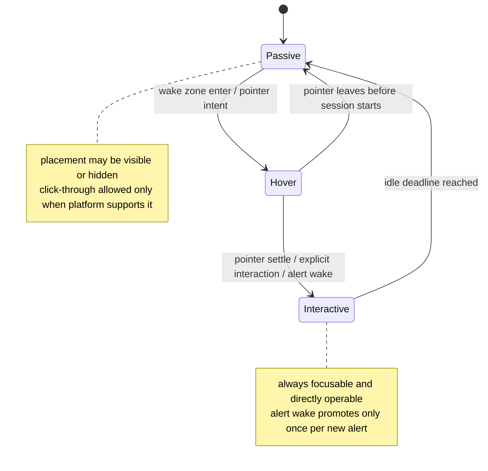

# Watch Tower v0.5 Desktop Behavior Upgrade 实施计划

## Overview

本计划只覆盖 `v0.5`，目标是在已完成的 `v0.4` 提醒闭环之上，把 edge widget 从“可用的常驻窄窗”升级为真正低打扰、可唤醒、可恢复的桌面组件。  
这一步不追求多 popup 编排、市场总览或试用发布，而是优先建立一个低风险的桌面行为主链路：`passive -> hover -> interactive -> passive`（see origin: `docs/brainstorms/2026-04-13-watch-tower-v0-5-desktop-behavior-requirements.md`）。

## Problem Frame

当前仓库已经具备主控台、resident widget、tray 以及最小 alert closure loop，但 widget 仍主要表现为一个固定位置、持续可见的常驻小窗。  
如果下一步直接追求更复杂的提醒编排，会偏离 `v0.5` 的真正问题；如果什么都不做，Watch Tower 又会停留在“存在感很强但桌面适配还不够成熟”的阶段。

`v0.5` 的正确定位因此不是“继续扩展提醒系统”，而是把以下体验做稳：

- widget 能在不影响轮询和 resident runtime 的前提下退入低干扰状态。
- 用户总能通过可预期路径把 widget 唤回到可交互态。
- `auto-hide`、`wake zone`、`hover reveal`、`click-through` 与 alert 拉起协同来自一份统一宿主状态，而不是散落在多个窗口和前端局部推断中。

如果这一版不能成立，后续 `v0.6` 的多窗口编排只会建立在脆弱的桌面行为前提之上。

## Requirements Trace

- R1. widget 桌面行为收敛为单一宿主级状态机，至少包含 `passive`、`hover`、`interactive` 三种稳定状态。
- R2. `auto-hide`、`wake zone`、`hover 唤醒` 与 `passive` 低干扰形态都由状态转换规则统一定义。
- R3. 无论当前处于何种状态，用户都存在一条可预期路径回到可交互态。
- R4. widget 支持贴边低干扰隐藏态，同时继续承接 resident 监控职责。
- R5. 隐藏态或 `passive` 形态具备稳定唤醒方式；平台不支持时需要可预期 fallback。
- R6. `click-through` 仅发生在 `passive`；`interactive` 必须保证可点击、可聚焦、可直接操作。
- R7. 平台能力不足时优先保证“可恢复、可交互、不会卡死”。
- R8. 新 alert 到来且 widget 处于 `passive` 时，widget 会被提升到一次可见可交互态。
- R9. `v0.5` 不扩展 popup 编排、未读队列管理或多 symbol 提醒系统。
- R10. tray / widget 不扩展成第二套主控台，不新增 group switching 或复杂控制面板。
- R11. 继续复用 resident runtime、共享 snapshot 与 `selectedGroupId` 语义，不再引入第二套真相来源。

## Scope Boundaries

- 不实现多 symbol popup 队列、可见上限、提醒优先级编排或提醒历史管理。
- 不新增 tray/widget 内的 group switching、复杂窗口策略编辑器或第二套控制台交互。
- 不在 `v0.5` 引入新的提醒状态层；继续消费 `v0.4` 的 `alert_runtime`。
- 不要求 Windows 与 macOS 使用完全相同的底层机制；这一版只要求交互结果可预期、可恢复。
- 不把这一版做成“桌面魔法展示”；重点是稳定、低打扰、可降级。

## Context & Research

### Relevant Code and Patterns

- `src-tauri/src/app_state.rs` 已维护统一 `AppSnapshot`、`RuntimeInfo` 与 `AlertRuntime`，适合作为新增 widget behavior runtime 的唯一状态源。
- `src-tauri/src/windows/edge_widget.rs` 已拥有 widget 建窗、复用、显示/隐藏与定位同步的基本模式，是 `v0.5` 窗口行为升级的核心入口。
- `src-tauri/src/windows/positioning.rs` 已将停靠边和尺寸约束收敛到纯函数计算，适合扩展为“visible / hidden”双 placement 规则。
- `src-tauri/src/windows/mod.rs` 目前统一同步 tray、widget、popup 三类 resident surfaces，适合作为 widget runtime 传播的宿主收口点。
- `src-tauri/src/commands/mod.rs` 已承接 resident 相关命令边界，若需要前端上报 coarse interaction intent，应继续从这里进入宿主。
- `src/windows/edge-widget/hooks/use-edge-widget-events.ts` 已建立 `get_bootstrap_state + APP_SNAPSHOT_EVENT` 的订阅模式，适合作为 widget behavior projection 的前端消费入口。
- `src/shared/view-models.ts` 已承担 dashboard、widget、popup 的只读视图构造职责，适合新增 widget behavior view model，而不是让组件自己拼状态。
- `src/shared/config-model.ts` 当前只保存 resident MVP 所需的最小窗口策略：`dockSide`、`widgetWidth`、`widgetHeight`、`topOffset`。这为 `v0.5` 提供了稳定几何基线，也提醒本版应克制新增配置面。
- `docs/tauri-multi-window-architecture.md` 已给出 `hover_state`、`platform/*` 和 `window-state` 的目标落点，但当前仓库还没有这些实现，说明本地模式对这一层仍然偏薄，需要在计划中明确平台 fallback。

### Institutional Learnings

- 当前仓库不存在 `docs/solutions/`，没有可直接复用的机构化经验文档。

### External References

- Tauri 官方 Window Customization 文档说明了透明、置顶、无边框等窗口能力的官方入口，适合作为 widget 窗口 traits 的约束背景。  
  <https://v2.tauri.app/learn/window-customization/>
- `tauri::webview::WebviewWindow` 官方 Rust API 文档包含 `set_ignore_cursor_events`，为 `passive` 态 click-through 的平台抽象提供了官方能力边界。  
  <https://docs.rs/tauri/latest/tauri/webview/struct.WebviewWindow.html>

## Key Technical Decisions

- 决策 1：`v0.5` 不新增用户可编辑的高级窗口策略配置项。
  - 理由：需求的核心是把行为做稳，而不是把实验性平台细节暴露成新的配置负担；当前 `dockSide / widgetWidth / widgetHeight / topOffset` 已足够作为行为计算基线。

- 决策 2：隐藏与显露不是第四种稳定状态，而是 `passive` 状态下的一种 placement 结果。
  - 理由：这样可以维持需求文档要求的三态模型，避免 `hidden / passive / hover / interactive` 四态并行带来的概念漂移。

- 决策 3：widget behavior runtime 进入共享 snapshot，而不是只存在于 widget 前端局部状态。
  - 理由：`alert_runtime`、tray、dashboard diagnostics 与 widget 本身都需要看到同一份“当前是否隐藏、是否可交互、是否处于 fallback”语义。

- 决策 4：宿主拥有状态转换和 idle 回落的主导权，前端只负责消费投影与上报 coarse interaction intent。
  - 理由：如果 hover / leave / alert wake 都由前端各自判断，很容易再次回到多窗口各自推断的状态分叉问题。

- 决策 5：wake zone 通过“隐藏 placement 仍保留一条可命中的边缘带”表达，不引入第二个传感器窗口。
  - 理由：这是满足可发现性与低 carrying cost 的最小方案，能避免为 `v0.5` 过早建立多窗口 hover sensor 体系。

- 决策 6：Windows 优先接原生 cursor-event ignore；不支持完整 click-through 的平台退化为“auto-hide + hover reveal + 非 click-through passive”。
  - 理由：需求优先级是“可恢复、可交互”，不是“每个平台都强行拥有完全一致的底层行为”。

- 决策 7：新 alert 只负责把 `passive` widget 拉到一次 `interactive`，不直接改写 `alert_runtime` 的现有去重和处理语义。
  - 理由：`v0.5` 需要消费提醒价值，但不能把自己升级成第二个提醒编排系统。

## Open Questions

### Resolved During Planning

- `wake zone` 应该怎样落地，才能兼顾可发现性与低误触？
  - 结论：使用隐藏 placement 保留一条贴边可命中的窄带，不引入额外 sensor window；该窄带由宿主几何计算统一决定。

- `passive` 与 `hover` 的边界应该由谁判定？
  - 结论：边界归宿主状态机所有。前端只上报粗粒度 interaction intent，最终模式切换与 idle 回落由宿主统一推进。

- 平台不支持完整 click-through 时，`v0.5` 应如何保持产品语义成立？
  - 结论：保留 `auto-hide + hover reveal + interactive recovery`，把 `click-through` 退化为 `passive` 视觉弱化而非强制原生穿透。

- 新 alert 拉起 widget 后，应如何回落到 `passive`？
  - 结论：由宿主维护 idle deadline；只要窗口仍被指针悬停、获得焦点或存在显式交互会话，就保持 `interactive`，否则回到 `passive`。

### Deferred to Implementation

- `wake zone` 的具体宽度、hover 延迟和 idle 超时时长取值。
  - 原因：这是实现期调优问题，不改变当前状态机边界和文件结构。

- macOS 上是否需要额外的窗口 focusable/ignore-cursor-events 组合修正。
  - 原因：需要结合实际平台表现验证，属于执行期平台适配问题。

- widget 在 `passive` 态的视觉弱化程度和 reveal 动画细节。
  - 原因：这些属于实现期交互调优，不影响本计划的状态与职责分工。

## Output Structure

```text
src-tauri/
  src/
    platform/
      mod.rs
      windows.rs
      macos.rs
    windows/
      hover_state.rs

src/
  shared/
    window-state.ts
```

## High-Level Technical Design

> 这张图用于表达 `v0.5` 的桌面行为主链路，是方向性说明，不是实现规范。执行时应把它当作状态和职责约束，而不是逐字翻译成代码。



## Implementation Units

- [x] **Unit 1: 建立 widget behavior runtime 契约与三态状态机**

**Goal:** 让宿主和前端围绕同一份 widget behavior runtime 协作，明确 `passive / hover / interactive` 三态、隐藏 placement、idle 回落和 alert 拉起的核心规则。

**Requirements:** R1, R2, R3, R8, R11

**Dependencies:** None

**Files:**
- Modify: `src-tauri/src/app_state.rs`
- Create: `src-tauri/src/windows/hover_state.rs`
- Modify: `src/shared/alert-model.ts`
- Modify: `src/shared/view-models.ts`
- Modify: `src/shared/events.ts`
- Create: `src/shared/window-state.ts`
- Test: `src-tauri/src/windows/hover_state.rs`
- Test: `src/shared/view-models.test.ts`
- Test: `src/shared/window-state.test.ts`

**Approach:**
- 在宿主侧新增纯状态机模块，明确：
  - 当前模式：`passive | hover | interactive`
  - 当前 placement：visible 或 hidden
  - 当前能力：是否允许 click-through、是否处于 fallback 模式
  - 当前会话来源：pointer wake、alert wake 或显式交互
- 在 `AppSnapshot` 中增加 widget behavior runtime 投影，而不是把这层状态塞进窗口内部缓存。
- 在 shared 层新增只读 `window-state` 契约，供 widget、dashboard diagnostics 和后续平台调试复用。
- `buildResidentWidgetViewModel` 应继续以共享 snapshot 为输入，附带导出 widget 当前模式、placement 和 fallback 文案，而不是让组件自己从多个字段重组。

**Execution note:** 先把纯状态机与 shared 契约测试钉住，再推进窗口行为和平台抽象，避免几何与 API 细节把状态边界冲散。

**Patterns to follow:**
- `src-tauri/src/app_state.rs` 里 `AlertRuntime` 的集中状态表达方式
- `src/shared/view-models.ts` 当前围绕 snapshot 构建只读 view model 的组织方式
- `src/shared/alert-model.ts` 与 Rust `AppSnapshot` 的镜像契约风格

**Test scenarios:**
- Happy path: 初始 `passive` 状态在收到 pointer wake intent 后进入 `hover`，随后在显式交互或 alert wake 下提升到 `interactive`。
- Happy path: `interactive` 在 idle deadline 到期后回落到 `passive`，且不会清空 resident 数据快照。
- Edge case: `passive` 隐藏 placement 仍被视为 `passive`，不会被额外建模成第四种稳定状态。
- Edge case: 新 alert 到来时，若 widget 已在 `interactive`，状态机不会重复重置会话或抖动。
- Error path: 平台能力标记为 unsupported 时，runtime 明确暴露 fallback 模式，而不是返回模糊空值。
- Integration: Rust snapshot 中的 widget runtime 变化能被 shared view model 稳定投影给前端，而不出现命名或语义漂移。

**Verification:**
- 宿主、widget 前端和调试面板已能围绕一份三态运行时语义对齐。
- 计划后续单元不需要再发明“观察态”“半隐藏态”等额外稳定状态。

- [x] **Unit 2: 落地宿主窗口编排、placement 计算与平台 fallback**

**Goal:** 让宿主真正控制 widget 的隐藏/显露、click-through 开关、alert 拉起和平台降级逻辑，而不是只移动一个固定位置窗口。

**Requirements:** R4, R5, R6, R7, R8, R11

**Dependencies:** Unit 1

**Files:**
- Create: `src-tauri/src/platform/mod.rs`
- Create: `src-tauri/src/platform/windows.rs`
- Create: `src-tauri/src/platform/macos.rs`
- Modify: `src-tauri/src/windows/edge_widget.rs`
- Modify: `src-tauri/src/windows/positioning.rs`
- Modify: `src-tauri/src/windows/mod.rs`
- Modify: `src-tauri/src/commands/mod.rs`
- Test: `src-tauri/src/windows/positioning.rs`
- Test: `src-tauri/src/platform/windows.rs`
- Test: `src-tauri/src/commands/mod.rs`

**Approach:**
- 将 positioning 从“单一 visible placement”扩展为面向 `passive`/`hover`/`interactive` 的 placement 计算，至少能表达：
  - visible x/y
  - hidden x/y
  - wake zone 对应的剩余可命中边界
- `edge_widget.rs` 不再只是“确保窗口存在并 show”，而是根据 runtime 同步窗口大小、位置、focusable 与 cursor-event 策略。
- `platform/*` 收口 click-through 能力探测与应用；Windows 走原生 ignore-cursor-events 路线，其他平台允许返回显式 fallback。
- 若前端需要上报 pointer enter / leave / interactive acknowledge 等 coarse intent，应继续通过 `commands/mod.rs` 进入宿主，而不是直接操作局部状态。
- alert 拉起复用现有 `alert_runtime`：当 runtime 处于 `passive` 且出现新 alert 时，宿主只提升 widget behavior runtime，不额外扩展 popup 逻辑。

**Patterns to follow:**
- `src-tauri/src/windows/edge_widget.rs` 当前的“ensure window -> compute placement -> sync traits”模式
- `src-tauri/src/windows/positioning.rs` 现有的纯函数定位测试模式
- `src-tauri/src/commands/mod.rs` 当前“命令更新 snapshot -> emit -> sync resident surfaces”的边界
- `docs/tauri-multi-window-architecture.md` 中对 `platform/*` 与 `hover_state` 职责的拆分建议

**Test scenarios:**
- Happy path: dock side 为 `right` 时，positioning 能同时计算 visible placement 与 hidden placement，并保留一条 wake zone 可见边界。
- Happy path: dock side 为 `left` 时，同一组规则能够镜像工作而不改变 top offset 记忆。
- Happy path: 新 alert 到来且 widget 处于 `passive` 时，宿主将 widget 提升到 `interactive` 一次，同时不影响现有 popup 链路。
- Edge case: 鼠标短暂离开后很快返回时，状态机不会频繁在 `hover` 和 `passive` 之间闪烁。
- Edge case: polling paused、backoff 或 stale 状态下，widget 仍可被唤醒和恢复交互，不因 resident health 状态进入死态。
- Error path: 平台不支持原生 click-through 时，宿主退回到明确 fallback，而不是把窗口留在不可点击或不可唤醒的中间态。
- Integration: 命令驱动的 widget intent 与宿主定时回落共同作用时，snapshot、tray 和 widget 本身看到的是同一份 behavior runtime。

**Verification:**
- widget 已具备由宿主驱动的隐藏、唤醒、交互与降级闭环。
- 平台差异被收口在 `platform/*`，而不是继续散落在窗口同步和前端判断中。

- [x] **Unit 3: 让 edge widget 前端消费行为投影并上报交互意图**

**Goal:** 让 widget 前端从“只渲染 resident 数据”升级为“正确响应宿主行为状态并提供最小交互回路”的界面，而不自行保存第二套 runtime。

**Requirements:** R2, R3, R5, R6, R8, R10, R11

**Dependencies:** Unit 1, Unit 2

**Files:**
- Modify: `src/windows/edge-widget/hooks/use-edge-widget-events.ts`
- Modify: `src/windows/edge-widget/index.tsx`
- Modify: `src/windows/edge-widget/components/status-footer.tsx`
- Modify: `src/shared/view-models.ts`
- Modify: `src/shared/events.ts`
- Test: `src/windows/edge-widget/hooks/use-edge-widget-events.test.tsx`
- Test: `src/windows/edge-widget/components/status-footer.test.tsx`
- Test: `src/windows/edge-widget/index.test.tsx`

**Approach:**
- `use-edge-widget-events.ts` 继续以 `get_bootstrap_state + APP_SNAPSHOT_EVENT` 为唯一数据入口，同时暴露 widget behavior view 和必要的 coarse intent action。
- widget 页面根据 behavior runtime 渲染 `passive / hover / interactive` 下的视觉和交互差异，但不再自己推断“何时隐藏”“何时回落”。
- 若宿主需要 hover enter / leave 或 explicit interact 信号，hook 负责把这些动作调用到命令边界，并在 browser preview 中提供稳定 fallback。
- `status-footer` 或等价只读区域应明确暴露当前是否处于 fallback / passive hidden 等状态，让平台降级是“可解释的”，而不是用户只能猜。
- 现有 resident 数据展示保持单组只读，不把 widget 变成新的 group 控制面板。

**Patterns to follow:**
- `src/windows/edge-widget/hooks/use-edge-widget-events.ts` 当前的 bootstrap + event subscribe 结构
- `src/windows/alert-popup/hooks/use-alert-popup-events.ts` 当前“前端消费 snapshot 并通过命令上报动作”的交互模式
- `src/windows/edge-widget/index.tsx` 当前“渲染 resident 内容 + footer”的轻量页面边界

**Test scenarios:**
- Happy path: 当 snapshot 中的 widget behavior runtime 进入 `hover` 或 `interactive` 时，页面会反映对应的 mode 和唤醒文案。
- Happy path: 当前端上报 coarse pointer intent 后，后续 snapshot 更新会驱动页面进入下一状态，而不是停留在本地假状态。
- Edge case: browser preview 没有 Tauri runtime 时，hook 仍能提供可预览的 fallback snapshot 和稳定空实现动作。
- Edge case: widget 处于 `passive` hidden placement 时，resident 数据仍保留，页面不会误判成“loading”或“no groups”。
- Error path: 宿主返回 fallback capability 时，前端会显示清晰说明，而不是继续暴露不成立的 click-through 心智。
- Integration: 新 alert 拉起 widget 后，widget 页面、popup 和 dashboard 共享同一轮 snapshot，不出现一边已拉起、一边仍显示旧 mode 的分叉。

**Verification:**
- widget 前端已能正确表现宿主状态，而不是自己管理另一套行为状态。
- 用户能从界面上理解当前 widget 处于隐藏、可唤醒、可交互还是平台 fallback。

- [x] **Unit 4: 补齐 diagnostics 可见性与 v0.5 验收清单**

**Goal:** 让 `v0.5` 从“技术上能 hide/reveal”提升为“行为可解释、降级可审计、实现可按闭环标准验收”的可交付桌面行为升级版。

**Requirements:** R3, R7, R8, R10, R11

**Dependencies:** Unit 2, Unit 3

**Files:**
- Modify: `src/windows/main-dashboard/components/diagnostics-panel.tsx`
- Modify: `src/windows/main-dashboard/hooks/use-app-events.ts`
- Modify: `src/windows/main-dashboard/hooks/use-app-events.test.tsx`
- Modify: `src/windows/main-dashboard/index.test.tsx`
- Create: `docs/checklists/v0-5-desktop-behavior-acceptance.md`

**Approach:**
- 主控台 diagnostics 继续作为“解释当前宿主行为”的中心位置，新增 widget mode、placement、fallback capability 或等价只读信息。
- 不新增新的配置器或高级参数表单；这一单元只负责把当前行为状态说清楚，便于验收与排错。
- 验收清单围绕“是否低打扰、是否能唤醒、是否能恢复、是否在 alert 到来时只拉起一次”组织，而不是围绕底层 API 是否被调用组织。
- 回归覆盖重点验证：snapshot 投影一致性、dashboard diagnostics 可见性、fallback 文案、alert 拉起后回落的一致性。

**Patterns to follow:**
- `src/windows/main-dashboard/hooks/use-app-events.ts` 当前的 snapshot 订阅与 focus intent 消费模式
- `src/windows/main-dashboard/components/diagnostics-panel.tsx` 现有的 health / diagnostics 说明职责
- `docs/checklists/v0-3-resident-acceptance.md` 与 `docs/checklists/v0-4-alert-closure-acceptance.md` 的闭环式验收组织方式

**Test scenarios:**
- Happy path: dashboard diagnostics 能正确显示 widget 当前 mode、placement 和是否处于 fallback。
- Happy path: 新 alert 触发 widget 拉起后，diagnostics 与 widget 页面都能反映同一轮状态变化。
- Edge case: 平台 fallback 生效时，dashboard diagnostics 仍给出可理解说明，而不是只显示空白或 generic error。
- Error path: widget behavior runtime 缺失或不完整时，dashboard 不会崩溃，而是展示明确的“行为运行时不可用”反馈。
- Integration: 按验收清单演练 `passive -> hover -> interactive -> passive` 与 `passive + new alert -> interactive -> passive` 两条主链路时，dashboard、widget 和 resident runtime 解释一致。

**Verification:**
- `v0.5` 的交付标准从“桌面窗口会动了”升级为“行为可解释、降级可恢复、链路可验收”。
- 后续进入 `v0.6` 时，不需要重新发明平台行为排错与验收口径。

## System-Wide Impact

- **Interaction graph:** `alert_runtime / commands / hover_state -> app snapshot -> edge_widget sync -> widget frontend + dashboard diagnostics + tray` 会成为新的多面同步路径，任何状态漂移都会直接影响唤醒和恢复体验。
- **Error propagation:** 平台不支持 click-through、窗口同步失败、状态机边界错误都必须回流到共享 diagnostics 或 widget behavior runtime，而不是只写日志。
- **State lifecycle risks:** `passive hidden`、`hover session`、`interactive idle deadline` 与 `alert wake` 会交叉出现，必须由宿主统一收敛，避免前端自己补状态。
- **API surface parity:** `AppSnapshot`、`shared/alert-model.ts`、`shared/view-models.ts`、widget hook 和 dashboard diagnostics 会同时消费新的 behavior runtime，命名与语义必须保持镜像一致。
- **Integration coverage:** 单纯的组件测试无法证明 `隐藏 -> hover 唤醒 -> interactive -> idle 回落` 及 `passive + alert wake` 两条链路，需要 Rust 状态机测试与前端 hook/页面回归共同覆盖。
- **Unchanged invariants:** `v0.5` 不改变 `selectedGroupId` 语义、不改变现有 alert 去重与已读回写、不引入多 popup 队列，也不把 widget 变成第二套主控台。

## Risks & Dependencies

| Risk | Mitigation |
|------|------------|
| 把隐藏与显露建模成第四种稳定状态，导致实现和文档语义漂移 | 明确隐藏只是 `passive` 下的 placement 结果，稳定状态始终只有三种 |
| 为了做 wake zone 过早引入第二个传感器窗口，扩大平台和生命周期复杂度 | 坚持先用隐藏 placement 保留窄带命中区，不做额外 sensor window |
| 前端自己推断 hover / interactive，宿主又在独立推进 idle timer，造成状态分叉 | 由宿主拥有状态推进权，前端只消费投影并上报 coarse intent |
| 某平台不支持原生 click-through，导致 widget 看不见或点不到 | 以可恢复优先，回退到非 click-through passive，并把 fallback 暴露到 diagnostics |
| 新 alert 拉起 widget 时顺手扩展成新的提醒编排入口 | 只消费现有 `alert_runtime`，把 alert wake 限制为一次 mode promotion |

## Documentation / Operational Notes

- 进入执行前，应准备一份 `v0.5` 验收清单，至少覆盖：
  - `passive -> hover -> interactive -> passive`
  - 左右停靠下的 visible / hidden placement
  - 平台不支持 click-through 时的 fallback 行为
  - 新 alert 到来时的单次 widget 拉起
  - polling paused / backoff / stale 状态下的恢复能力
- 执行中若发现某平台必须依赖额外窗口或更复杂命中模型，应该先回写计划再扩 scope，而不是直接在实现里偷渡第二套状态机。
- 若开发态与安装包态的窗口行为存在明显差异，应把差异记录到验收清单或试用说明，而不是在 `v0.5` 内临时扩大目标。

## Sources & References

- Origin document: `docs/brainstorms/2026-04-13-watch-tower-v0-5-desktop-behavior-requirements.md`
- Related roadmap: `docs/plans/2026-04-10-001-feat-watch-tower-roadmap-plan.md`
- Related completed plans:
  - `docs/plans/2026-04-10-002-feat-watch-tower-v0-1-foundation-plan.md`
  - `docs/plans/2026-04-11-003-feat-watch-tower-v0-2-main-dashboard-plan.md`
  - `docs/plans/2026-04-11-004-feat-watch-tower-v0-3-resident-mvp-plan.md`
  - `docs/plans/2026-04-12-005-feat-watch-tower-v0-4-minimal-alert-closure-plan.md`
- Architecture reference: `docs/tauri-multi-window-architecture.md`
- Related code:
  - `src-tauri/src/app_state.rs`
  - `src-tauri/src/commands/mod.rs`
  - `src-tauri/src/windows/mod.rs`
  - `src-tauri/src/windows/edge_widget.rs`
  - `src-tauri/src/windows/positioning.rs`
  - `src/shared/alert-model.ts`
  - `src/shared/config-model.ts`
  - `src/shared/view-models.ts`
  - `src/windows/edge-widget/hooks/use-edge-widget-events.ts`
  - `src/windows/main-dashboard/components/diagnostics-panel.tsx`
- External docs:
  - <https://v2.tauri.app/learn/window-customization/>
  - <https://docs.rs/tauri/latest/tauri/webview/struct.WebviewWindow.html>
