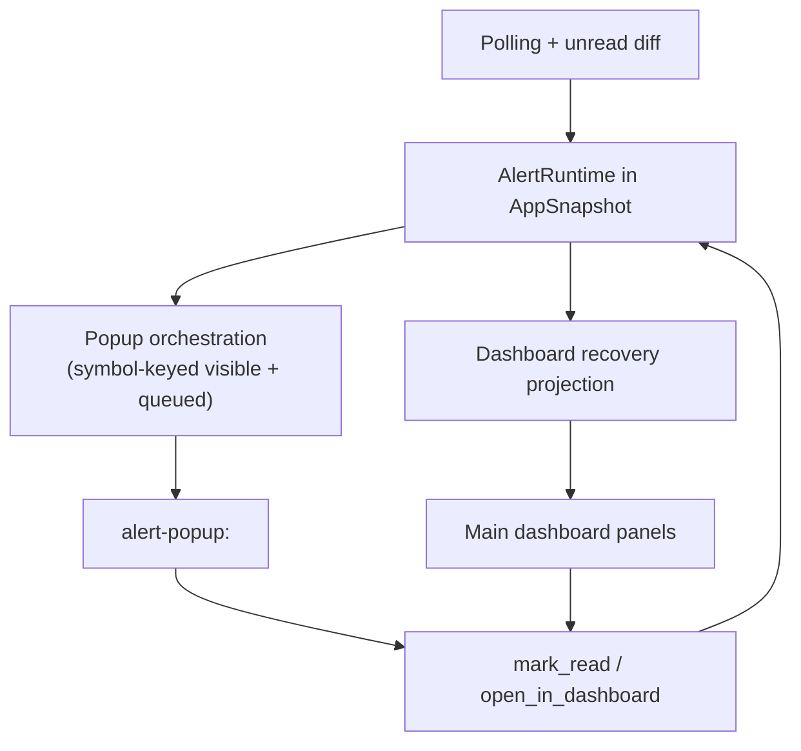
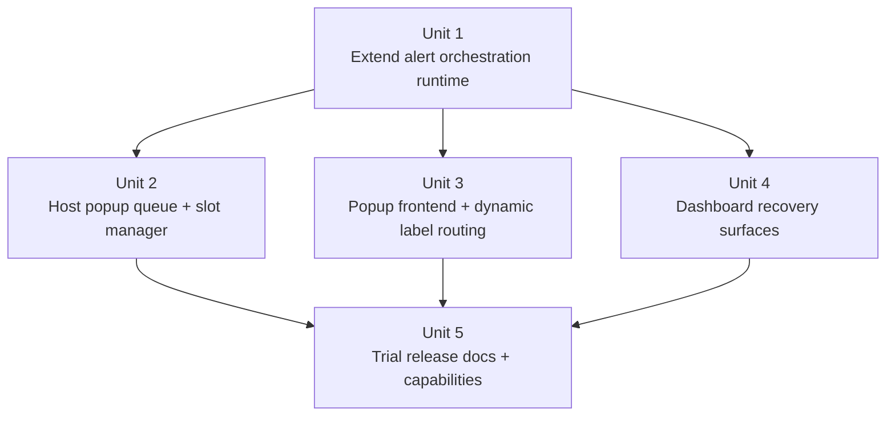
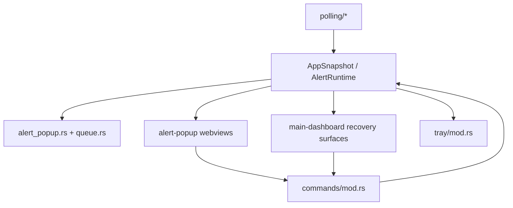

# Watch Tower v0.6 Orchestration & Trial Release 实施计划

## Overview

本计划只覆盖 `v0.6`，目标是在已完成的 `v0.4` 提醒闭环和 `v0.5` 桌面行为升级之上，把 Watch Tower 从“本地 daily-driver 已成立”的产品，推进到“多告警可控、可对外试用”的桌面版本（see origin: `docs/plans/2026-04-10-001-feat-watch-tower-roadmap-plan.md`）。

这一步不再重新证明单 alert 或单 widget 行为，而是优先补齐三条缺口：

- 多 symbol 新信号并发时，popup 需要复用、排队、限流和可恢复，而不是单活动窗口串行推进。
- 用户错过弹窗后，主控台需要稳定的未读恢复/回看入口，而不是让提醒消失后没有继续处理的路径。
- 当前仓库需要最小试用发布收口，包括 README、试用验收清单，以及和动态窗口标签相匹配的能力边界说明。

## Problem Frame

当前代码已经证明 Watch Tower 具备：

- 主控台配置与分组管理
- resident widget + tray 的常驻链路
- unread diff、系统通知、单 popup、已读回写与失败回滚
- `passive / hover / interactive` 的 widget 行为状态机

但 `v0.4` 和 `v0.5` 仍然建立在一个更窄的提醒前提上：**同一时刻只需要处理一个活动 popup**。这让产品在单人本地验证时已经足够，但在真实使用里会暴露三个问题：

- 多个 symbol 在同一轮轮询中产生新未读时，现有 `active_alert + pending_alerts` 语义更像 backlog，而不是面向窗口编排的运行时。
- 前端 popup 页面和 Rust 窗口管理都仍以单一 `alert-popup` 标签为中心，无法表达“同 symbol 复用、不同 symbol 排队”的设计目标。
- 对外试用阶段需要更可解释的安装与使用文档，否则用户拿到安装包后依然不知道如何验证 resident、提醒和恢复链路。

因此 `v0.6` 的关键不是再做一套新提醒系统，而是把现有 `AlertRuntime` 推进成**可编排、可恢复、可试用**的版本。

## Requirements Trace

- R1. 继续复用 `v0.4` 已成立的提醒闭环：检测、通知、跳转、标记已读、失败回滚。
- R2. 继续复用 `v0.5` 已成立的桌面行为运行时，不重做 widget 的状态机与平台 fallback。
- R3. 多 symbol 同时出现新未读时，popup 必须支持复用、排队、可见上限和确定性优先级。
- R4. 同一 symbol 的新未读应复用现有 popup stream，而不是重复开窗。
- R5. 用户错过 popup 后，仍能在主控台中稳定找到未读恢复/回看入口。
- R6. 多窗口编排、主控台恢复入口和 popup 前端都必须建立在共享 snapshot 上，而不是各自维护第二套提醒真相来源。
- R7. `v0.6` 试用发布至少要交付 README、试用验收清单，以及与动态 popup 标签相匹配的 window capability 调整。
- R8. `v0.6` 不扩展成完整通知中心、复杂静音策略或 tray/widget 内 group switching。

## Scope Boundaries

- 不重做 `v0.4` 的 unread diff、已读写回和 dashboard focus intent 语义，只在其上增加编排能力。
- 不重做 `v0.5` 的 `widget_runtime`、hover 策略或 click-through fallback。
- 不把 tray 或 widget 扩展成第二套主控台。
- 不引入历史提醒归档、复杂静音规则、按信号类型的通知策略或完整通知中心。

### Deferred to Separate Tasks

- `src/windows/market-overview/` 相关增强视图：仅在 core `v0.6` 已稳定且不影响试用发布节奏时追加；否则拆成后续独立任务，不阻塞本计划主线。

## Context & Research

### Relevant Code and Patterns

- `src-tauri/src/app_state.rs` 当前把 `AlertRuntime`、`WidgetBehaviorRuntime` 和全局 `AppSnapshot` 收敛为单一宿主状态源；`v0.6` 需要延续这个集中式模式，而不是把 popup queue 下沉到前端局部状态。
- `src-tauri/src/windows/alert_popup.rs` 已提供单 popup 的建窗、定位和显示/隐藏边界，是多 popup orchestration 最直接的演进点。
- `src-tauri/src/windows/mod.rs` 目前统一同步 tray、widget 和 popup 三类 resident surface，适合作为 popup manager 的宿主收口点。
- `src/shared/view-models.ts` 当前已承担 widget、dashboard、popup 的只读视图构造职责，适合作为“按 symbol 投影 popup view”和“主控台恢复视图”的共享层。
- `src/windows/alert-popup/hooks/use-alert-popup-events.ts` 当前以单活动 alert 为核心消费 snapshot，后续需要从“单全局 popup”切换为“按当前 window label 解析 popup stream”。
- `src/windows/main-dashboard/index.tsx` 与 `src/windows/main-dashboard/hooks/use-app-events.ts` 已具备消费 snapshot 和 focus intent 的模式，适合继续承接恢复入口，而不额外发明新的数据获取方式。
- `src/app.tsx` 当前通过窗口标签精确匹配 `edge-widget` 和 `alert-popup` 选择页面；多 symbol popup 会要求它支持前缀式标签路由。
- `src-tauri/capabilities/alert-popup.json` 当前只覆盖固定标签 `alert-popup`；若转为 `alert-popup:<symbol>`，能力范围必须同步放宽到 label pattern。
- `docs/tauri-multi-window-architecture.md` 已经给出“同 symbol 复用 popup、最多 3 个可见 popup、队列排队”的目标形态，适合作为本计划的设计约束。
- `docs/brainstorms/` 中没有对应 `v0.6` 的 requirements 文档，因此本计划以 roadmap 为 origin，并在本地研究基础上补齐技术决策。

### Institutional Learnings

- 当前仓库不存在 `docs/solutions/`，没有可直接复用的机构化 learnings 文档。

### External References

- 本次未额外进行外部研究；现有仓库模式和 `docs/tauri-multi-window-architecture.md` 已足够支撑 `v0.6` 的技术规划。

## Key Technical Decisions

| Decision | Choice | Rationale |
|---|---|---|
| Reminder truth source | 在共享 snapshot 内演进现有 `AlertRuntime` | 避免为多 popup 编排平行造第二套提醒状态层 |
| Popup identity | 以 `symbol` 作为 popup stream / window 复用键 | 与架构文档一致，也能避免同 symbol 重复开窗 |
| Visible capacity | 宿主维护固定可见 slot，上限外进入队列 | 控制屏幕占用和提醒噪音，让行为具备确定性 |
| Recovery entry | 主控台消费同一份 snapshot 渲染未读恢复入口 | 错过 popup 后仍有稳定处理路径，且不需要二次请求 |
| Trial-release scope | README + checklist + capability/label 调整优先，市场总览不阻塞 | 先交付首个可试用版本，再决定是否扩展示图层 |

- 决策 1：`v0.6` 不引入新的前端 popup store，Rust 宿主仍是 popup orchestration 的主导者。
  - 理由：多窗口创建、队列推进和屏幕几何本来就属于宿主能力边界。

- 决策 2：`AlertRuntime` 从“单活动 alert + backlog”演进为“可见 popup streams + queued alerts + recovery-oriented unread projection”的统一提醒运行时。
  - 理由：这样可以保持 `mark_read`、`dashboard_focus_intent` 与 unread dedupe 都继续建立在同一份语义上。

- 决策 3：popup window label 采用前缀模式（如 `alert-popup:<symbol>`），而不是继续复用单一 `alert-popup` 标签。
  - 理由：同 symbol 复用和不同 symbol 并发是 `v0.6` 的核心能力，label 需要直接反映这一点。

- 决策 4：主控台恢复入口优先服务“错过 popup 后继续处理未读”，而不是在 `v0.6` 直接做完整提醒历史系统。
  - 理由：恢复路径是试用验证的关键，而完整历史系统会把 scope 膨胀到通知中心问题。

- 决策 5：`market-overview` 仅作为 challenger extension，不阻塞 core `v0.6`。
  - 理由：它能增强展示力，但不是当前多告警可控与试用发布的关键路径。

## Open Questions

### Resolved During Planning

- 多 popup 编排是应该落在新的 runtime 里，还是继续演进现有 `AlertRuntime`？
  - 结论：继续演进 `AlertRuntime`，让其在共享 snapshot 中表达 orchestration 结果。

- 同 symbol 新 alert 到来时应如何处理？
  - 结论：复用现有 popup stream，更新内容、重置可见会话并提升优先级，而不是再开新窗。

- 错过 popup 后的恢复入口应该放在哪里？
  - 结论：优先放在主控台，由其消费 snapshot 中的未读恢复投影，而不是依赖 tray/widget 临时扩权。

- `market-overview` 是否是 `v0.6` 的阻塞项？
  - 结论：不是。它可以作为 `v0.6` 的 challenger extension，但不阻塞 core 试用发布。

### Deferred to Implementation

- 可见 popup 上限最终是 `3` 还是依显示器高度动态下调。
  - 原因：这是实现期几何调优问题，不影响当前 plan 的职责分工。

- popup 自动消失的具体时长、同 symbol bump 的时间重置规则。
  - 原因：需要结合真实交互表现调优，属于执行期行为参数。

- Windows 安装包的最终命名、图标和版本号策略。
  - 原因：这属于试用发布收口细节，不改变本计划的架构与文件边界。

## Output Structure

```text
src-tauri/
  capabilities/
    alert-popup.json
  src/
    windows/
      alert_popup.rs
      mod.rs
      queue.rs

src/
  windows/
    alert-popup/
      components/
        alert-card.tsx
      hooks/
        use-alert-popup-events.ts
    main-dashboard/
      components/
        recovery-panel.tsx
        unread-queue.tsx

docs/
  checklists/
    v0-6-trial-release-acceptance.md

README.md
```

## High-Level Technical Design

> 这张图用于表达 `v0.6` 的运行时主链路，是方向性说明，不是实现规范。执行时应把它当作状态和职责约束，而不是逐字翻译成代码。



## Implementation Units



- [ ] **Unit 1: 演进共享 alert runtime 为多 symbol orchestration 契约**

**Goal:** 让宿主、popup 前端和主控台围绕同一份可编排提醒运行时协作，而不是继续依赖单活动 alert 语义。

**Requirements:** R1, R3, R4, R5, R6

**Dependencies:** None

**Files:**
- Modify: `src-tauri/src/app_state.rs`
- Modify: `src-tauri/src/commands/mod.rs`
- Modify: `src/shared/alert-model.ts`
- Modify: `src/shared/view-models.ts`
- Test: `src/shared/alert-model.test.ts`
- Test: `src/shared/view-models.test.ts`
- Test: `src-tauri/src/commands/mod.rs`

**Approach:**
- 在 Rust 侧把 `AlertRuntime` 从 `active_alert + pending_alerts` 演进为可表达以下语义的结构：
  - 当前可见 popup streams
  - 等待进入可见 slot 的 queued alerts
  - 恢复入口需要消费的未读投影
  - 已存在的 `pending_read` 与 `dashboard_focus_intent`
- 明确“symbol 是 popup stream 键”，“alert id 是单条提醒键”，避免 stream 级复用和 alert 级处理混在一起。
- shared 层同步镜像 Rust 契约，让 popup 前端和 dashboard 都消费相同字段命名与语义。
- 继续保留现有 `mark_alert_read` / `open_alert_in_dashboard` 命令边界，但让其能够处理“从 stream 中删除当前 alert 并推进后续编排”的结果。

**Patterns to follow:**
- `src-tauri/src/app_state.rs` 现有 `AlertRuntime` 的集中状态表达与 helper 方法组织方式
- `src/shared/view-models.ts` 当前围绕 snapshot 构建只读投影的模式
- `src-tauri/src/commands/mod.rs` 当前“更新 snapshot -> emit -> sync resident surfaces”的边界

**Test scenarios:**
- Happy path: 同一轮进入两个不同 symbol 的新 unread 时，runtime 会产生两个不同 popup streams 或一个 visible + 一个 queued 结果，而不是覆盖前一条 alert。
- Happy path: 同 symbol 出现更新 alert 时，runtime 复用同一 stream 键并提升其优先级，而不是创建重复 stream。
- Edge case: 已处于 `pending_read` 的 alert 不会在新的 snapshot 中重新进入 visible 或 queued 集合。
- Edge case: 当 active/visible stream 被标记已读后，runtime 会推进同 symbol 后续 alert 或下一个 queued stream，而不是留下空洞。
- Error path: 若 `open_alert_in_dashboard` 针对的 group 在当前 config 中不存在，runtime 不会破坏现有队列结构。
- Integration: Rust snapshot 中的 orchestration 字段能被 shared 模型与 view-model 正确投影，不出现 snake_case / camelCase 语义漂移。

**Verification:**
- 共享 snapshot 已能表达多 symbol popup、恢复入口和当前 pending read 的同一套提醒语义。
- 后续单元不需要再自行发明“popup queue state”或“dashboard recovery state”。

- [ ] **Unit 2: 落地宿主 popup queue manager 与多窗口编排**

**Goal:** 让 Rust 宿主真正拥有 popup stream 创建、复用、排队、slot 计算和回收逻辑，而不是继续只控制一个固定标签的弹窗。

**Requirements:** R1, R3, R4, R6

**Dependencies:** Unit 1

**Files:**
- Create: `src-tauri/src/windows/queue.rs`
- Modify: `src-tauri/src/windows/alert_popup.rs`
- Modify: `src-tauri/src/windows/mod.rs`
- Test: `src-tauri/src/windows/queue.rs`
- Test: `src-tauri/src/windows/alert_popup.rs`

**Approach:**
- 将 popup 位置与 slot 分配逻辑从单窗口 `alert_popup.rs` 中提炼到 `queue.rs`，保持“队列/几何”与“建窗/同步 traits”职责分离。
- popup label 采用 `alert-popup:<symbol>`，并由宿主根据 symbol 复用窗口实例。
- 宿主基于当前 monitor work area、dock side 和 visible slot 上限计算窗口堆叠位置；屏幕高度不足时，低优先级 popup 留在 queue，而不是强行重叠。
- 当某 popup 被标记已读、跳入 dashboard 或超时退出时，宿主负责释放 slot 并推进队列，而不是等待前端自行推断。

**Technical design:** *(directional guidance, not implementation specification)*

```text
normalized unread delta
  -> AlertRuntime recompute
  -> queue manager assigns visible slots
  -> windows/mod syncs visible popup labels
  -> missing labels hide / recycle
```

**Patterns to follow:**
- `src-tauri/src/windows/edge_widget.rs` 现有“ensure window -> compute placement -> sync traits”模式
- `src-tauri/src/windows/positioning.rs` 现有的纯函数几何测试风格
- `src-tauri/src/windows/alert_popup.rs` 当前单 popup 的 monitor / work area 定位边界

**Test scenarios:**
- Happy path: 当 visible slot 仍有空位时，不同 symbol 的 popup 会分别建窗并占据不同 slot。
- Happy path: 同 symbol 新 alert 到来时，宿主复用 `alert-popup:<symbol>` 窗口而不是新建第二个同 symbol window。
- Edge case: 当 visible slot 已满时，新 symbol alert 进入 queue，而已可见 popup 保持稳定位置，不发生互换抖动。
- Edge case: 屏幕高度不足以容纳全部 visible slots 时，slot manager 会减少可见 popup 数量或将低优先级项留在队列，而不是产生重叠坐标。
- Error path: 某个 popup window 无法获取 monitor 信息时，宿主不会让整个 resident surface sync 崩溃。
- Integration: 当一个 popup 被处理后，下一条 queued symbol 能被推进到释放的 slot，并通过 resident sync 一致地显示出来。

**Verification:**
- Rust 宿主已能按 symbol 复用 popup，并在多 symbol 情况下稳定分配和回收 slot。
- 多 popup 编排逻辑被收敛在宿主，而不是散落到前端页面或命令回调中。

- [ ] **Unit 3: 让 popup 前端支持动态标签路由与 stream 级消费**

**Goal:** 让 popup 页面从“读取全局单活动 alert”升级为“按当前 window label 读取对应 popup stream”，同时保持现有直接处理动作不变。

**Requirements:** R1, R3, R4, R6

**Dependencies:** Unit 1, Unit 2

**Files:**
- Modify: `src/app.tsx`
- Modify: `src/windows/alert-popup/index.tsx`
- Modify: `src/windows/alert-popup/hooks/use-alert-popup-events.ts`
- Modify: `src/windows/alert-popup/components/alert-card.tsx`
- Test: `src/app.test.tsx`
- Test: `src/windows/alert-popup/hooks/use-alert-popup-events.test.tsx`
- Test: `src/windows/alert-popup/components/alert-card.test.tsx`

**Approach:**
- `src/app.tsx` 从精确匹配 `alert-popup` 调整为支持 popup label 前缀匹配，避免新增 symbol 级窗口后回退到 dashboard 页面。
- popup hook 从 snapshot 中解析“当前窗口标签对应的 popup stream”，而不是总是读取全局单一 active alert。
- `AlertCard` 继续承接“标记已读 / 打开主控台”两个主动作，但它消费的 view model 需要能表达 stream 的当前 alert、队列状态或重用提示。
- browser preview 保持可预览 fallback，但要能模拟多 symbol 环境下的某一条 popup stream，而不是只模拟单全局 active alert。

**Patterns to follow:**
- `src/windows/alert-popup/hooks/use-alert-popup-events.ts` 当前 bootstrap + snapshot subscribe + invoke action 的交互模式
- `src/app.tsx` 当前按窗口标签分发页面的入口边界
- `src/shared/view-models.ts` 当前为 popup 构建只读 view model 的方式

**Test scenarios:**
- Happy path: 当前窗口标签为 `alert-popup:ETHUSDT` 时，popup 页面会消费 ETH stream，而不是 BTC 或全局第一条 alert。
- Happy path: 用户点击“Open in dashboard”后，对应 stream 会从 popup 页面消失，并把 focus intent 正确交给主控台。
- Edge case: 当前窗口标签对应的 stream 已被队列推进或移除时，页面会进入可解释的 idle/closing 状态，而不是抛异常。
- Edge case: browser preview 下仍能稳定渲染一个 mock popup stream，并允许测试 mark-read / open-in-dashboard 的 fallback 逻辑。
- Error path: snapshot 中不存在当前标签对应的 stream 时，hook 不会误用其他 symbol 的 popup 数据。
- Integration: 当 Rust 宿主复用同 symbol 窗口并更新其 stream 时，popup 页面会在同一窗口中反映新内容，而不是需要重新建窗。

**Verification:**
- 多个 popup window 可以共享同一套前端页面入口，但各自消费正确的 symbol stream。
- popup 前端不再依赖“单全局活动 alert”的前提。

- [ ] **Unit 4: 在主控台补齐未读恢复入口与处理路径**

**Goal:** 让用户错过 popup 后，仍能在主控台里找到一条直接、稳定、与现有 alert 行为一致的恢复路径。

**Requirements:** R1, R5, R6, R8

**Dependencies:** Unit 1

**Files:**
- Modify: `src/windows/main-dashboard/index.tsx`
- Modify: `src/windows/main-dashboard/hooks/use-app-events.ts`
- Create: `src/windows/main-dashboard/components/unread-queue.tsx`
- Create: `src/windows/main-dashboard/components/recovery-panel.tsx`
- Test: `src/windows/main-dashboard/index.test.tsx`
- Test: `src/windows/main-dashboard/components/unread-queue.test.tsx`
- Test: `src/windows/main-dashboard/components/recovery-panel.test.tsx`
- Test: `src/windows/main-dashboard/hooks/use-app-events.test.tsx`

**Approach:**
- 在 shared view model 中新增面向 dashboard 的未读恢复投影，按 symbol / period / signal type 提供最小必要信息。
- 主控台新增恢复面板，只负责两类动作：
  - 打开对应详情并聚焦当前未读
  - 直接触发已读处理
- 恢复入口与 popup 共用同一套命令边界，避免主控台写另一份“本地已读逻辑”。
- 面板位置应贴近现有 diagnostics / health / detail 流程，确保用户在 dashboard 中能自然发现，而不是埋在另一个切页结构里。

**Patterns to follow:**
- `src/windows/main-dashboard/index.tsx` 当前 `DashboardShell` 组合与 aside 面板结构
- `src/windows/main-dashboard/hooks/use-app-events.ts` 当前 snapshot + invoke 边界
- `src/windows/alert-popup/hooks/use-alert-popup-events.ts` 当前 mark-read / open-in-dashboard 的调用方式

**Test scenarios:**
- Happy path: 当 snapshot 中存在 queued 或 recently missed unread 时，dashboard 恢复面板会渲染对应列表，并可直接打开详情。
- Happy path: 用户从恢复面板执行 mark read 后，对应项会从恢复列表中移除，并保持与 popup queue 一致。
- Edge case: 当前没有可恢复的 unread 时，面板渲染明确 empty state，而不是显示空白容器。
- Edge case: 当前恢复项所属 group 不是 `selectedGroupId` 时，打开详情动作会沿用现有 focus intent 语义切换到正确 group。
- Error path: 已读写回失败时，恢复面板会保留该项或恢复其状态，而不是错误地从列表永久移除。
- Integration: popup 被关闭但 unread 未处理时，dashboard 恢复面板仍能显示该项，形成跨窗口连续处理路径。

**Verification:**
- 用户即使错过 popup，也能在主控台稳定回看并处理未读。
- dashboard 恢复入口与 popup 行为共享同一套 snapshot 和命令语义。

- [ ] **Unit 5: 完成试用发布收口与文档验收**

**Goal:** 让 `v0.6` 不只是“代码能运行”，而是具备交给外部试用用户安装、理解和验证的最小交付形态。

**Requirements:** R7, R8

**Dependencies:** Unit 2, Unit 3, Unit 4

**Files:**
- Modify: `src-tauri/capabilities/alert-popup.json`
- Create: `README.md`
- Create: `docs/checklists/v0-6-trial-release-acceptance.md`

**Approach:**
- 将 popup capability 从固定 `alert-popup` 标签调整为覆盖 symbol 级动态标签的模式，确保多窗口 popup 不会因 label 漂移失去 IPC 能力。
- README 聚焦外部试用用户最需要知道的内容：
  - 产品是什么
  - 如何配置 API 与 group
  - resident / popup / dashboard 的核心链路
  - 已知限制与当前非目标
- 试用验收清单围绕“多 popup 编排是否成立、恢复路径是否成立、打包后行为是否成立”组织，而不是围绕内部实现细节组织。

**Patterns to follow:**
- `docs/checklists/v0-4-alert-closure-acceptance.md` 与 `docs/checklists/v0-5-desktop-behavior-acceptance.md` 的闭环式验收组织方式
- `src-tauri/capabilities/default.json`、`src-tauri/capabilities/edge-widget.json` 现有 capability 文件结构

**Test scenarios:**
- Happy path: 使用动态 popup label 的窗口仍然拥有所需 IPC 能力，前端命令调用不因 capability 失配而失败。
- Happy path: README 能让首次试用用户完成配置、启动 resident 链路并理解 popup / recovery 行为。
- Edge case: 用户只体验 dashboard 而没有 resident 场景时，README 仍能清楚解释当前版本的试用重点与限制。
- Error path: 若 packaged build 与 dev build 在 popup 或 widget 行为上存在差异，试用验收清单必须显式要求记录而不是忽略。
- Integration: 按 checklist 演练“多 symbol 告警 -> popup 编排 -> 错过 popup -> dashboard 恢复 -> 已读回写”整条链路时，用户可以不依赖实现知识完成验证。

**Verification:**
- 动态 popup labels 与 capability 边界保持一致。
- 仓库已具备首个可对外试用版本所需的 README 和验收材料。

## System-Wide Impact



- **Interaction graph:** `polling/* -> AlertRuntime -> popup queue manager -> popup webviews -> commands/mod.rs -> snapshot` 会成为 `v0.6` 的核心闭环，dashboard recovery surfaces 也会挂在同一链路上。
- **Error propagation:** 已读写回失败、popup window 创建失败、capability label 失配都必须回流到共享 snapshot 或显式 UI 反馈，而不是只写日志。
- **State lifecycle risks:** `queued -> visible -> acted -> recovered` 会新增多一层生命周期；一旦 stream 级与 alert 级状态混淆，就会出现重复提醒、漏提醒或恢复面板与 popup 不一致。
- **API surface parity:** Rust `AlertRuntime`、TypeScript `AppSnapshot`、popup hook、dashboard hook 和 capability labels 都会一起变化，任何一个面没有同步都会导致多窗口行为破裂。
- **Integration coverage:** 仅靠组件测试不足以证明多 popup 编排和恢复路径成立；至少需要 Rust 侧 queue 测试、shared 投影测试和前端 hook/页面回归共同覆盖。
- **Unchanged invariants:** `selectedGroupId` 仍是 resident 当前组选中真相；`v0.4` 的 unread diff 与已读回写仍然存在；`v0.5` 的 widget behavior runtime 仍由宿主主导，`v0.6` 不改变这些基础前提。

## Risks & Dependencies

| Risk | Mitigation |
|------|------------|
| 为了做多 popup 编排，平行造第二套提醒状态层 | 坚持在共享 snapshot 内演进现有 `AlertRuntime` |
| popup labels 改为动态后，前端路由或 capability 不再匹配 | 在 `src/app.tsx` 和 `src-tauri/capabilities/alert-popup.json` 中同步处理 label pattern |
| 多 symbol 队列推进与已读回写交叉，导致重复提醒或漏提醒 | 在 runtime helper 与 queue manager 中明确 stream 级和 alert 级职责，并用集成测试覆盖 |
| 恢复面板变成第二个提醒中心，scope 膨胀 | 只支持最小恢复动作，不引入完整历史、筛选和静音策略 |
| `market-overview` 抢占实现时间，拖慢试用发布 | 明确其为 challenger extension，不阻塞 core `v0.6` 交付 |

## Documentation / Operational Notes

- `v0.6` 完成后，应至少保留一份试用验收清单覆盖：
  - 多 symbol 同轮告警的 popup 复用与排队
  - popup 被处理或关闭后的队列推进
  - 错过 popup 后的 dashboard 恢复路径
  - packaged build 与 dev build 的行为差异记录
- 若执行期发现 `AlertRuntime` 的演进会迫使大面积重写 `polling/unread_diff.rs` 或 `widget_runtime` 语义，应先回写计划再扩 scope。
- 若试用用户需要更明确的默认样例配置，可以在 README 中加入最小 demo 配置，但不应在本计划中引入新的 bootstrap wizard。

## Sources & References

- **Origin document:** `docs/plans/2026-04-10-001-feat-watch-tower-roadmap-plan.md`
- Related code:
  - `src-tauri/src/app_state.rs`
  - `src-tauri/src/commands/mod.rs`
  - `src-tauri/src/windows/mod.rs`
  - `src-tauri/src/windows/alert_popup.rs`
  - `src/windows/alert-popup/hooks/use-alert-popup-events.ts`
  - `src/windows/main-dashboard/index.tsx`
  - `src/shared/view-models.ts`
  - `src/app.tsx`
- Architecture reference: `docs/tauri-multi-window-architecture.md`
- Related completed plans:
  - `docs/plans/2026-04-12-005-feat-watch-tower-v0-4-minimal-alert-closure-plan.md`
  - `docs/plans/2026-04-13-006-feat-watch-tower-v0-5-desktop-behavior-plan.md`
