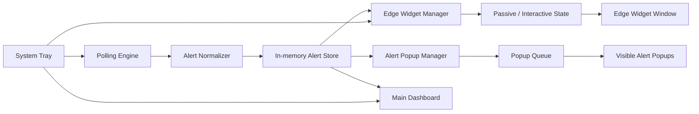
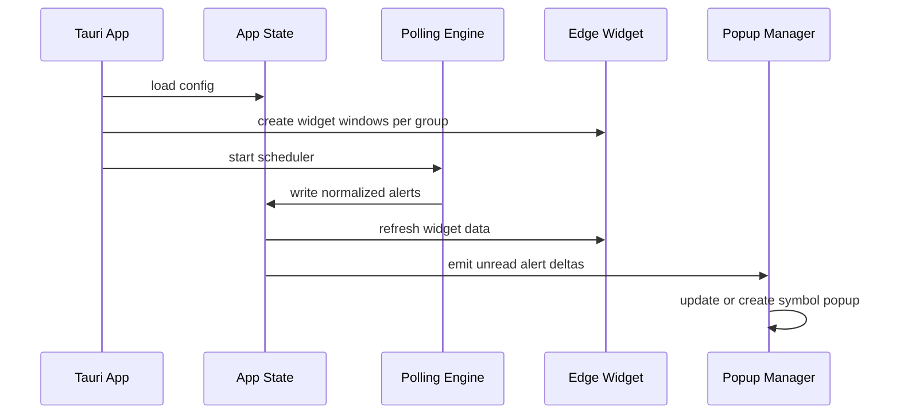

# Tauri Multi-Window Architecture

## Goal

Implement four desktop behaviors together:

1. Left dock, right dock, and auto-hide edge attachment
2. Click-through in passive mode with hover wake-up
3. Multi-symbol floating alert windows with stacking and queueing
4. A narrow translucent edge widget that always shows all configured periods

This document matches the Pencil designs:

- `05 Slide-out Alert`
- `06 Edge Widget`
- `07 Dock & Auto-hide`
- `08 Hover & Click-through`
- `09 Multi-window Orchestration`

## Window Inventory

### 1. Main dashboard window

- Purpose: full configuration, detail drill-down, group editing
- Visibility: normal app window, can hide to tray
- Traits:
  - resizable
  - standard interactions
  - not click-through

### 2. Edge widget window

- Purpose: always-on overview for one configured group
- Visibility: always-on-top, borderless, translucent
- Traits:
  - left-docked or right-docked
  - optional auto-hide
  - passive mode can be click-through
  - wakes into interactive mode on hover zone enter

### 3. Alert popup windows

- Purpose: show newly unread alerts with direct action affordances
- Visibility: temporary, always-on-top, edge-sliding
- Traits:
  - one popup per active symbol alert stream
  - capped visible count, overflow goes to queue
  - same-symbol alerts reuse the same popup window

### 4. Tray controller

- Purpose: lifecycle control, quick commands, health state
- Visibility: system tray only
- Traits:
  - restore dashboard
  - mute notifications
  - pause polling
  - show degraded/backoff state

## Recommended Tauri Window Labels

```text
main-dashboard
edge-widget:<groupId>
alert-popup:<symbol>
```

## High-Level Runtime Diagram



## Process Responsibilities

### Rust side

- Own window creation and window traits
- Manage docking and absolute positioning
- Control click-through and always-on-top flags
- Listen to tray events and OS-level focus changes
- Run polling timer and backoff strategy
- Emit normalized window-state events to frontend webviews

### Frontend webviews

- Render widget, popup, and dashboard UI
- Handle hover-state visuals
- Render period matrices and 60-bar timelines
- Trigger optimistic read updates
- Send interaction intents back to Rust commands

## State Model

### Widget state

```text
Passive
  - always_on_top = true
  - click_through = true
  - low_opacity
  - only wake zone is visually emphasized

HoverArmed
  - cursor entered wake zone
  - click_through = false
  - border highlight on
  - expand if auto-hidden

Interactive
  - full pointer events enabled
  - buttons, scroll, hover cards active
  - exit after mouse leaves for N ms
```

### Popup state

```text
Queued -> SlidingIn -> Visible -> Acting -> SlidingOut
```

Rules:

- Reuse the existing popup for the same symbol
- Show at most 3 visible popups at once
- Stack by priority:
  - unread newest first
  - then unread older
  - then non-critical queued visible
- Collapse lower-priority popups if screen height is insufficient

## Docking Model

### Shared config

```ts
type DockSide = "left" | "right";

interface WidgetWindowConfig {
  groupId: string;
  dockSide: DockSide;
  autoHide: boolean;
  clickThroughWhenPassive: boolean;
  wakeZoneWidth: number;
  widgetWidth: number;
  widgetHeight: number;
  topOffset: number;
}
```

### Position rules

- Left dock:
  - visible x = `0`
  - hidden x = `-(widgetWidth - wakeZoneWidth)`
- Right dock:
  - visible x = `screenWidth - widgetWidth`
  - hidden x = `screenWidth - wakeZoneWidth`
- Y position should remain stable for muscle memory
- Keep a small inset from top edge so the tray or menu area is not crowded

## Hover and Click-Through Behavior

### Recommended interaction policy

- Passive mode:
  - click-through enabled
  - no heavy hover UI
  - content readable but subdued
- Wake zone hover:
  - disable click-through immediately
  - if hidden, animate widget into visible position
  - start interaction session timer
- Leave widget:
  - after 1200-2000 ms with no hover and no focused child controls
  - restore passive mode
  - if auto-hide enabled, slide back to docked hidden position

### Tauri implementation notes

Use Rust window APIs plus platform-specific extensions where needed:

- always on top
- transparent window
- decorations off
- resizable off for widget and popup windows
- ignore cursor events in passive mode if platform allows

Where native click-through behavior differs by OS:

- Windows: use native HWND flags
- macOS: use NSWindow mouse ignore behavior
- Keep the abstraction in a small platform module

## Multi-Symbol Popup Orchestration

### Allocation strategy

- One edge widget per group
- One popup label per symbol
- Same-symbol new alert:
  - update existing popup content
  - bump priority
  - restart visible timeout
- Different-symbol new alert:
  - create popup if visible slots remain
  - otherwise push into queue

### Suggested popup slot positions

For right-edge layout:

```text
slot 1: top-most
slot 2: 208px below slot 1
slot 3: 208px below slot 2
```

For left-edge layout:

- mirror the same layout to the left side

### Queue behavior

- Queue stores normalized popup payloads
- When one popup closes:
  - dequeue highest-priority pending popup
  - render into freed slot

## Polling and Backoff

### Polling rules

- Default polling interval: 60 seconds
- Minimum interval: 10 seconds
- On HTTP 429 or 5xx:
  - enter degraded mode
  - pause active polling for 3 minutes
  - update tray icon state
  - update widget footer state
  - optionally dim popup creation except critical unread

### Suggested engine

```text
Idle
 -> Polling
 -> Success
 -> Polling

Polling
 -> 429/5xx
 -> Backoff

Backoff
 -> timer elapsed
 -> Polling
```

## Suggested Event Contract

### Rust -> frontend

```ts
type AppEvent =
  | { type: "widget_state_changed"; groupId: string; mode: "passive" | "hover" | "interactive" }
  | { type: "widget_position_changed"; groupId: string; dockSide: "left" | "right"; hidden: boolean }
  | { type: "popup_show"; symbol: string; payload: AlertPopupPayload }
  | { type: "popup_update"; symbol: string; payload: AlertPopupPayload }
  | { type: "popup_hide"; symbol: string }
  | { type: "polling_backoff"; retryAt: number }
  | { type: "polling_resumed" };
```

### Frontend -> Rust

```ts
type UiIntent =
  | { type: "mark_read"; symbol: string; period: string; signalType: string }
  | { type: "open_main_dashboard"; symbol?: string }
  | { type: "set_widget_mode"; groupId: string; autoHide: boolean; dockSide: "left" | "right" }
  | { type: "mute_notifications"; muted: boolean };
```

## Suggested Module Layout

```text
src-tauri/
  src/
    main.rs
    app_state.rs
    polling/
      mod.rs
      alerts_client.rs
      scheduler.rs
      backoff.rs
    windows/
      mod.rs
      main_dashboard.rs
      edge_widget.rs
      alert_popup.rs
      positioning.rs
      hover_state.rs
      queue.rs
    tray/
      mod.rs
    platform/
      mod.rs
      windows.rs
      macos.rs

src/
  windows/
    main-dashboard/
    edge-widget/
    alert-popup/
  shared/
    alert-model.ts
    events.ts
    period-utils.ts
    window-state.ts
```

## Startup Sequence



## Build Order

1. Build `main-dashboard`
2. Build one `edge-widget` window with left/right dock
3. Add auto-hide and wake zone
4. Add passive click-through and hover wake
5. Add one `alert-popup`
6. Add popup stacking and queue reuse by symbol
7. Add tray degraded-state and backoff visibility

## Practical Notes

- Keep widget rendering very cheap; it is always visible
- Avoid creating one popup per alert event forever; reuse by symbol
- Keep geometry logic in Rust, not in frontend code
- Keep period-to-bar calculation in shared TypeScript so widget, popup, and dashboard render the same result
- Do optimistic read updates in UI, but keep a small local rollback path if write-back fails
